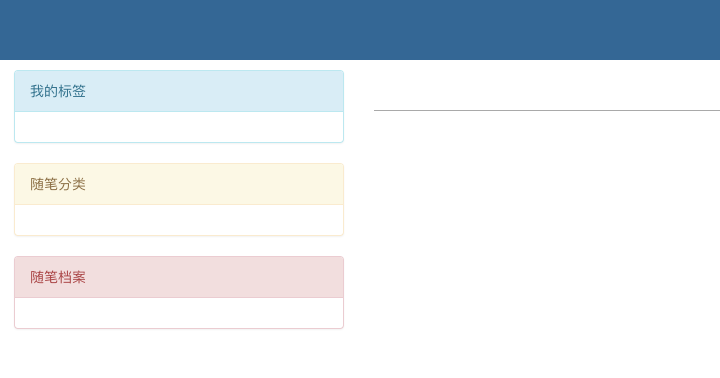

文章详情页之`inclusion_tag`语法

**用于将数据和样式结合为一个整体时使用**


在展示博客个人主页`(home_site)`函数和文章详情`(article_detail)`函数页时，返回了不同的`HTML`网页，但在页面中都使用了同一套分类框架面板，所以可以通过`extends`模板标签语法，继承于同一套基类模板



**文章详情页HTML模板**

包含博客站点页的`top`栏，以及分类栏

```html
<head>
    <meta charset="UTF-8">
    <title>Title</title>
    <!--在此加载所有要继承基类的js文件-->
    <link rel="stylesheet" href="/static/css/base.css">
    <link rel="stylesheet" href="/static/css/article_detail.css">
    <link rel="stylesheet" href="/static/bootstrap-3.3.7/css/bootstrap.css">
    <script type="text/javascript" src="/static/jquery/jquery-3.3.1.js"></script>
    <script type="text/javascript" src="/static/js/recommend.js"></script>
</head>
<body>
<div class="nav-top">
    <div class="blog-title">
        <!--通过视图函数中的blog=user.blog获取到的博客站点对象-->
        <a href="">{{ blog.title }}</a>
    </div>
    <div class="nav-btn">
        <a href="/admin/">管理</a>
    </div>
</div>
<div class="container-fluid">
    <div class="row">
        <div class="col-md-3">
            
            <!--标签分类面板-->
            <div class="panel panel-info">
                <div class="panel-heading">我的标签</div>
                <div class="panel-body">
                    
                        <p><a href="/{{ username }}/tag/{{ tag.title }}">{{ tag.title }}({{ tag.article_count }})</a>
                        </p>
                    
                </div>
            </div>
            
            <!--分类面板-->
            <div class="panel panel-warning">
                <div class="panel-heading">随笔分类</div>
                <div class="panel-body">
                    
                        <p><a href="/{{ username }}/category/{{ cate.title }}">{{ cate.title }}({{ cate.article_count }})</a>
                        </p>
                    
                </div>
            </div>
            
            <!--日期分类面板-->
            <div class="panel panel-danger">
                <div class="panel-heading">随笔档案</div>
                <div class="panel-body">
                    
                        <p>
                            <a href="/{{ username }}/archive/{{ date.month | date:'Y' }}/{{ date.month | date:'m' }}">{{ date.month | date:'Y-m' }}({{ date.article_count }})</a>
                        </p>
                    
                </div>
            </div>
            
        </div>
        <div class="col-md-9 ">
            <!--预留的文章列表block，继承后在内编写显示文章列表-->
            

            
        </div>
    </div>
</div>
</body>
```


但是展示样式的时候，没有显示分类数据，是因为在视图函数中没有返回`cate_list、tag_list、date_list`，所以无法循环取出分类数据，需要再次执行个人站点`(home_site)`视图函数中的`ORM`语句

```python
cate_list=Category.objects.values('nid').filter(blog=user.blog).annotate(article_count=Count('article__nid')).values('title','article_count')

       tag_list=Tag.objects.filter(blog=user.blog).values('nid').annotate(article_count=Count('article__nid')).values('title', 'article_count')

    
date_list = Article.objects.filter(user=user).annotate(month=TruncMonth('create_time')).values('month').annotate(article_count=Count('nid')).values('month', 'article_count')
```


可以再次在article_detail视图函数中执行得到变量，但是编写了重复的代码，我们可以将其封装在一个函数中，调用执行即可

```python
def get_classification(user):

    cate_list = Category.objects.values('nid').filter(blog=user.blog).annotate(
        article_count=Count('article__nid')).values('title', 'article_count')

    tag_list = Tag.objects.filter(blog=user.blog).values('nid').annotate(article_count=Count('article__nid')).values('title', 'article_count')

    date_list = Article.objects.filter(user=user).annotate(month=TruncMonth('create_time')).values('month').annotate(article_count=Count('nid')).values('month', 'article_count')

    return {'cate_list': cate_list, 'tag_list': tag_list, 'date_list_2': date_list}
```


**但是**`Django`提供了一个自定义模板语法`inclusion_tag`，该标签可以直接渲染数据和样式

### `inclusion_tag`模板语法

#### 1、首先自定义标签，新建`templatetags`文件夹，自定义`my_filter.py`文件

自定义`inclusion_tag`标签，执行自定义函数，函数中通过`ORM`语句获取了`cate_list、tag_list、date_list`，函数将数据以字典的形式传入`cate_style.html`模板文件，而不是返回给调用者

```python

from django import template
from blog import models
from django.db.models import Count
from django.db.models.functions import TruncMonth


register = template.Library()

#执行函数的返回结果，不是返回给调用者，而是返回值装饰器所指定的模板文件cate_style.html
@register.inclusion_tag('cate_style.html')
def get_classification(username):
    user = models.UserInfo.objects.filter(username=username).first()
    blog = user.blog

    cate_list = models.Category.objects.values('nid').filter(blog=blog).annotate(
        article_count=Count('article__nid')).values('title', 'article_count')

    tag_list = models.Tag.objects.filter(blog=blog).values('nid').annotate(article_count=Count('article__nid')).values('title', 'article_count')

    date_list = models.Article.objects.filter(user=user).annotate(month=TruncMonth('create_time')).values('month').annotate(article_count=Count('nid')).values('month', 'article_count')

    return {'cate_list': cate_list, 'tag_list': tag_list, 'date_list_2': date_list, 'username': username}
```


#### 2、调用自定义标签

调用自定义标签时，传入函数中的`username`变量，得到的就一个封装好`html`样式和渲染完毕数据的模板文件

```html
<div class="container-fluid">
    <div class="row">
        <div class="col-md-3">
            <!--先读取load出自定义的标签文件-->
            
            
            <!--通过标签调用函数，传入函数所需的username变量，这样就读取出了模板样式+数据-->
            
        </div>
        <div class="col-md-9 ">
            

            
        </div>
    </div>
</div>
```