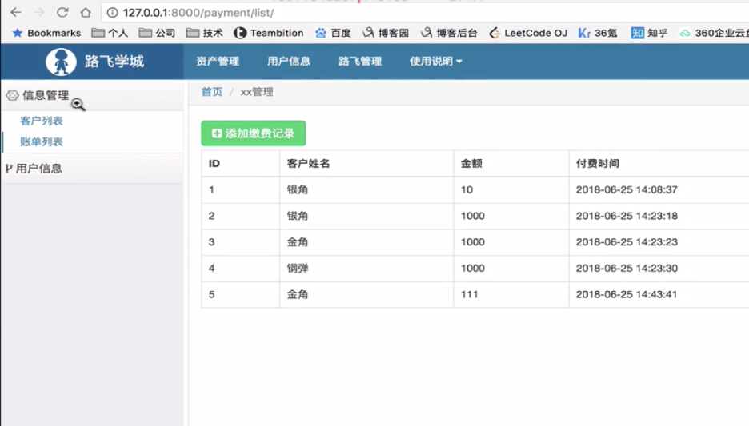

**项目和应用`templates`文件夹查找顺序**

在`views.py`视图函数中，返回`html`模板文件时，`templates`文件夹是依次从项目下至已注册应用的顺序去查找的


**`permission__isnull`:**

在`ORM`语句中，可以使用`permission__isnull = False`，`列名__isnull=False`去筛选不为空的记录

```python
url_list = UserInfo.objects.filter(        name=request.POST.get('name'),roles__permissions__isnull=False).values_list('roles__permissions__url').distinct()
```


**列表生成式**

由

```python
permission_list = []
for item in permission_queryset:
	url = item['permission_url']
	permission_list.append(url)
```

简化成列表生成式

```python
permission_list = [ item['permission_url'] for item in permission_queryset]
```


**设置`mysql`数据库模式**

在`django`中通过`python3 manage.py makemigrations`时创建表，**会报错或警告**，这是因为`mysql`数据库开启的严格模式，关闭该模式后即可，修改后**重启`mysql`服务**	

```
SET @@global.sql_mode= '';
```


**验证用户登录的用户名和密码正确性：**

1、通过`auth`模块去验证用户名密码是否登录，在使用`auth`模块的`auth.authenticate`方法去验证用户名和密码时，在创建表类时，必须继承于`AbstractUser`

2、尝试了使用全局钩子去校验用户名和密码，但是由于创建`UserInfo`表接口时，继承了`AbstractUser`类，导致存储的密码都是经过加密的，所以直接通过全局钩子去校验总是提示用户名或密码错误

正确的做法是：

通过`forms`组件可以初始化登录或注册页面的表单

通过`forms`组件可以校验单一或多个字段所填写的内容，如用户是否存在，密码和确认密码是否一致等

但是如果要校验登录的用户名和密码是否正确，就一定要使用`auth`模块


**关于`AbstractUser`**

继承`AbstractUser`后，无需再创建`username`、`password`等变量，该类中已经定义好了，在创建超级用户时`python3 manage.py createsuperuser`，会在终端中依次使用定义变量中的`verbose_name`来显示注册字段，如提示输入`username，password`和邮箱，由于邮箱是手动定义的字段，不是继承的，所以会以中文显示

```shell
python3 manage.py createsuperuser
Username: root
# username和password是Abstract类中定义好的，所以没写verbose_name，而邮箱是自己定义的，添加verbose_name参数，所以是中文
邮箱: root@163.com
Password: 
Password (again): 
Superuser created successfully.
```


**验证用户是否已登录**

调用`request.user.is_authenticated`，返回`True`或`False`


**正则表达式的`^$`**

使用正则表达式匹配数据时，一定要添加`^$`，表示匹配开头和匹配结尾，否则如果较长的字符串中包含了`/customer/list/`，那么也会被认为匹配成功

```
如
/customer/list/
/customer/list/asdsad
```


**正则表达式`search`和`match`的区别**

 `search`会扫描整个`string`查找匹配；

`match`只有在0位置匹配成功的话才有返回，

如果不是开始位置匹配成功的话，`match`就返回`none`。


**在`settings.py`中定义公共变量：**

在`django`项目中，如果变量或者`key`使用次数很多的话，可以将其写在`settings.py`中，引入`settings`后调用


**`static`配置**

在`settings.py`中设置：

```python
STATIC_URL = '/static/'
# 如果此处写为STATIC_DIRS，那么就是
# 如果写为STATICFILES_DIRS，那么就是
STATIC_DIRS = os.path.join(BASE_DIR,'static')
```

在`html`文件中编写：

```python
# 先加载static

<link rel="stylesheet" href="">

# 如果设置了DEBUG = True那么static就会失效
DEBUG = False
```


**如何实现动态菜单加载的思路：**

根据登录用户的权限列表，在对应的一级菜单下展示权限列表中URL对应的中文菜单，如有两个一级菜单，有哪些权限的URL就让其显示在对应的一级菜单下

如何实现动态加载一级和二级菜单？




`null=True`

表示数据库存储数据时，数据库允许为空


`blank=True`

表示在`django`后台`admin`页面中操作数据时，可以写为空


**`inclusion_tag`装饰器**

加载动态菜单时，可以使用`inclusion_tag`装饰器，将返回的数据直接返回到`html`文件中，并在`html`网页中通过``

```python
from django import template
from luffy_permission.settings import PERMISSION_SESSION_KEY

register = template.Library()

# 将函数中的结果{'menu_list': menu_list}数据返回到'static_menu.html'模板中
@register.inclusion_tag('static_menu.html')
def static_menu(request):
    customer_menu_info = request.session.get(PERMISSION_SESSION_KEY)
    menu_list = []

    for permission in customer_menu_info:
        if permission['is_menu'] == True:
            menu_list.append(permission)

    return {'menu_list': menu_list}
```

在`html`加载菜单

```python
# 模板文件显示为
<div class="static-menu">
    
        
            <a href="{{ menu.url }}" class="menu-first active">
                <span class="icon-wrap"><i class="fa fa-connectdevelop"></i></span>{{ menu.title }}
            </a>
        
    
</div>
```

并在`html`占用引入这块`html`，加载数据

最终显示菜单是调用函数，而不是模板文件`static_menu.html`

```python


```


如果在`django`的`admin`后台中，没有已创建的表，那是因为没有在`admin.py`中注册表

```python
from django.contrib import admin
from rbac import models

admin.site.register(models.UserInfo)
admin.site.register(models.Permission)
admin.site.register(models.Role)
admin.site.register(models.Menu)
```


**展示父子级菜单的思路:**

一级菜单单独创建一个表，存储一级菜单

```python
class Menu(models.Model):
    title = models.CharField(verbose_name='菜单名称',max_length=20)
    icon = models.CharField(verbose_name='图标',max_length=20)

    def __str__(self):
        return self.title
```

创建二级菜单后，设置外键关联一级菜单表

```python
class Permission(models.Model):
    title = models.CharField(verbose_name='标题', max_length=32)
    url = models.CharField(verbose_name='含正则的URL', max_length=128)
    icon = models.CharField(verbose_name='图标',max_length=20)
	
    # 外键列，可以为空，为空时表示不是菜单，不为空时表示二级菜单，与menu表关联
    menu = models.ForeignKey(
        verbose_name='父级菜单',to='Menu',to_field='id',null=True,blank=True,help_text='如果非空，表示父节点序号，如果为空表示不是二级菜单',
        on_delete=True
    )

    def __str__(self):
        return self.title
```

登录时，初始化用户权限`init_permission`，先查询出所有的一级菜单

```python
 menu_queryset = Menu.objects.values('title')
```

按用户名过`permission__role__username`过滤出属于当前用户权限的title、url，和上级菜单的menu__title，和一级菜单嵌套循环，比对查询出一级菜单的所有二级菜单信息

```python
from rbac.models import *
from luffy_permission.settings import PERMISSION_SESSION_KEY

def init_permission(request, username):

    # 查询出所有的一级菜单
    menu_queryset = Menu.objects.all().values('title')

    # 在权限表中查询出所有的二级菜单信息和跨表他们的父级菜单信息menu__title
    permission_query = Permission.objects.filter(role__userinfo__username=username).values('title','url','icon','menu__title','menu__icon')

    permission_menu_info = {}

    # 循环一级菜单queryset集合
    for menu in menu_queryset:
        # 如果在字典中没有获取到当前字典中的key值，那么就创建一个
        if not permission_menu_info.get(menu['title']):
            permission_menu_info[menu['title']] = []
        # 循环二级菜单queryset集合
        for permission in permission_query:
            # 判断如果二级菜单的父级菜单名称和循环中一级菜单的名称相匹配就在permission_menu_info字典中
            # 以父级菜单的名称为key，以二级菜单的信息为value形成一个字典
            if permission['menu__title'] == menu['title']:
                permission_menu_info[menu['title']].append(permission)

    # 最后形成了一个以一级菜单为key，关联二级菜单信息为value的字典，存储到session中
    request.session[PERMISSION_SESSION_KEY] = permission_menu_info
```

在`html`中循环存储在`session`中的字典，展示一级和二级菜单

```python
<div class="static-menu">
	# 循环字典要在字典后添加items，循环的内容是key和value
    
        <a href='' class="father-child">
            <span class="icon-wrap"><i class="fa {{ menu_value.0.menu__icon }}"></i></span>{{ menu_key }}
        </a>
        <div class="child-menu">
            
                
                    <a href='' class="child-menu selected">
                        <span class="icon-wrap"><span class="fa {{ child_menu.icon }}"></span></span>{{ child_menu.title }}
                    </a>
                
                    <a href='' class="child-menu">
                        <span class="icon-wrap"><span class="fa {{ child_menu.icon }}"></span></span>{{ child_menu.title }}
                    </a>
                
            
        </div>
    
</div>
```


**在`html`中引入`css`和`js`文件:**

虽然配置的是项目下的`static`，但是其实是在应用下的`static`下查找的，但是需要在`settings.py`中进行设置

```python
# 指向的是settings.py文件上层的上层文件夹，也就是项目的根目录
BASE_DIR = os.path.dirname(os.path.dirname(os.path.abspath(__file__)))

STATIC_URL = '/static/'

# 将static文件夹配置到各个应用下
STATIC_DIRS = [
    os.path.join(BASE_DIR,'rbac','static'),
    os.path.join(BASE_DIR,'web','static'),
]
```

都是在`static`下路径依次查找的，但是首先需要在`settings.py`中进行设置

```python
# 通过即可访问到应用下static下的各个路径
<link rel="stylesheet" href="">
```

