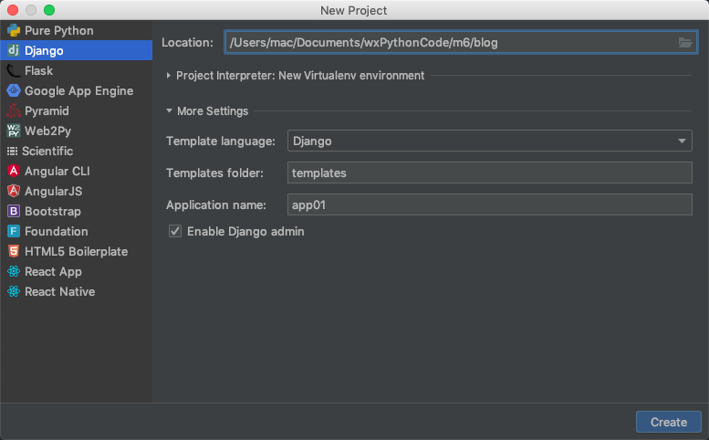
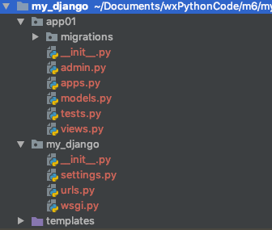

通过pycharm创建Django项目

##### 1、通过`New Project...`创建项目，项目类型选择Django，并在`More Setting`中添加应用信息




##### 2、创建完毕后即生成Django项目目录，包含了所需的文件




##### 3、在项目的`urls.py`中控制路由分发逻辑

在`urls.py`文件中编辑`urlpatterns`列表，添加路径函数。pattern：模式

```python
urlpatterns = [
    path('admin/', admin.site.urls),
    path('timer/', views.timer),
]
```


##### 4、在应用的`view.py`中添加视图函数

```python
# request就是environ
def timer(request):
    ctime = datetime.datetime.now().strftime('%Y-%m-%d %X')
    # 固定格式，return render(request,templates下的html文件，{key:value}为传入html文件中的参数)
    # Django会自动找到templates文件夹下的html文件，{"ctime":ctime}表示传入HTML文件中的参数
    return render(request,'timer.html',{"ctime":ctime})
```


##### 5、编辑html文件，并接收参数

```html
<!DOCTYPE html>
<html lang="en">
<head>
    <meta charset="UTF-8">
    <title>Title</title>
</head>
<body>
    <!--在{{ctime}}中接收参数，显示在html网页中-->
    <h3>当前时间：{{ ctime }}</h3>
</body>
</html>
```