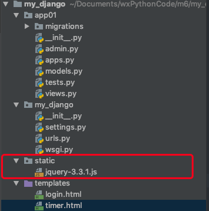
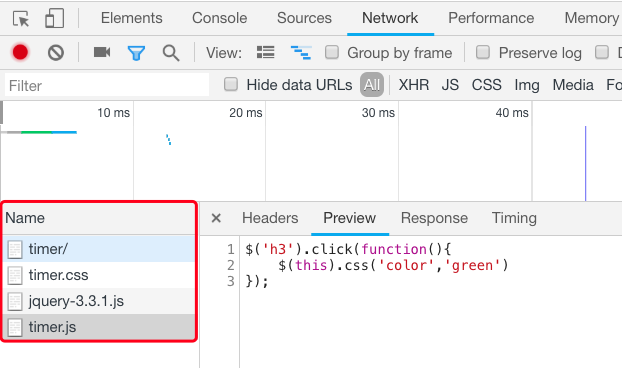

静态文件配置

##### 1、在Django项目下创建`static`文件夹，存放静态文件，包含js、css等




##### 2、在`settings.py`文件中为`/static/`别名设置实际路径

```python
#在URL路径中如果遇到/static/，并没有在urls.py、views.py文件中为其设置路由分发，和视图函数。
#而是在settings.py文件中，Django将其设置为别名，以及为别名设置实际请求路径
STATIC_URL = '/static/'

STATICFILES_DIRS = [
    #os.path.join()表示连接字符串为一个路径，如first_pro/static
    #BASE_DIR为当前的项目路径，static表示项目下的static文件夹，其中存放静态文件
    os.path.join(BASE_DIR,'static')
]
```


##### 3、在HTML文件中为静态文件设置别名路径

```html
<!DOCTYPE html>
<html lang="en">
<head>
    <meta charset="UTF-8">
    <title>Title</title>
    <!--解耦css静态文件，在static文件下新增目录如css、js等，解耦文件类型-->
    <link rel="stylesheet" href="/static/css/timer.css">
</head>
<body>
    <h3>当前时间：{{ ctime }}</h3>
</body>
<!--当HTML调用JS文件时，在请求路径中遇到了/static/，则表示别名。在网页代码中该别名对应项目下的/static/文件夹，这样就能找到了对应的文件-->
<script type="text/javascript" src="/static/js/jquery-3.3.1.js"></script>
<!--解耦js文件-->
<script type="text/javascript" src="/static/js/timer.js"></script>
</html>
```


在加载timer路径时，浏览器请求了4次，分别为timer路径、css、js、jquery，都是根据`settings`中的别名和实际路径找到的静态文件

