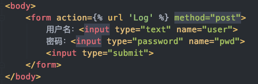

#### 一、在HTML中反向解析

##### 模板语法包含`{{xxx}}`和``这两种

**总述：**

在路由分发中使用别名快速查找URL路径，在路由分发代码中添加`name=xxx`，其中`xxx`就表示当前路径,，以后通过``在HTML中就表示路径了：

```python
urlpatterns = [
    path('Log/',views.login,name = 'Log'),
]
```


1、首先网页from表单是先呈现给用户的页面，用户点击【提交】按钮

```html
<form action="http://127.0.0.1:8000/login/" method="post">
    用户名：<input type="text" name="user">
    密码：<input type="password" name="pwd">
    <input type="submit">
</form>
```


2、浏览器根据`action="http://127.0.0.1:8000/login/"`向指定URL发起post请求


3、Django在`urls.py`路由分发，执行指定视图函数


4、视图函数在最后执行返回页面时，会先解析`login.html`文件，并在代码中发现``，

```python
return render(request,'login.html')
```


5、于是在路由分发文件中按照`Log`别名，查找到对应的路径，执行了`login`视图函数

```python
urlpatterns = [
    # 添加name = 'Log'参数，为当条路径设置别名，Log别名就对应于'Log/'路径
    path('Log/',views.login,name = 'Log'),
]
```


6、在HTML网页中引用别名对应的路径

```html
<!-- 将之前action属性的URL替换为 -->
<form action= method="post">
    用户名：<input type="text" name="user">
    密码：<input type="password" name="pwd">
    <input type="submit">
</form>
```


#### 二、在Python中反向解析

在python中反向解析得到url路径的作用是，以后会用到

```python
#引入反向解析函数
from django.urls import reverse

def timer(request):
    # reverse(路由分发urls.py文件中的别名)，得到别名对应的路径，如'Log/'
    url = reverse('Log')
    print(url)
    
    #y_a别名所对应的路由分发路径是articles/([0-9]{4})/，这个路径内容中包含分组正则表达式，如果此时执行timer路径，页面会报错“Reverse for 'y_a' with no arguments not found”，
    #解决办法是，在reverse函数中必须传入匹配分组正则表达式的任意值,添加args=(xxxx,)
    #url = reverse('y_a',args=(1999,))，就可以正确打印url了
    url = reverse('y_a')
    print(url)
```


#### 三、反向解析的目的：

action请求的URL如果发生变化，改为了`action="http://127.0.0.1:8000/Log/"`，那么此时需要修改2个地方，给代码维护带来了不便

1、`form`表单的`action`属性

```
action="http://127.0.0.1:8000/Log/"
```

2、`urls.py`中的路由控制路径

```
path('Log/',views.login)
```

3、所以此时，可以在路由分发`urls.py`中为路径设置别名

```python
urlpatterns = [
    # 添加name = 'Log'参数，为当条路径设置别名，Log别名就对应于'Log/'路径，以后可以将'Log/'路径修改为任何其他路径，因为'Log'别名永远对应着最新的路径
    path('Log/',views.login,name = 'Log'),
]
```

4、在HTML代码中引用别名对应的路径

```html
<!-- 将之前action属性的URL替换为 -->
<form action= method="post">
    用户名：<input type="text" name="user">
    密码：<input type="password" name="pwd">
    <input type="submit">
</form>
```

5、在浏览器控制台中查看HTML网页，显示为


代码中显示为`<form action= method="post">`



通过别名查找路由分发`urls.py`中的路径`path('Log/',views.login,name = 'Log')`

#### 所以，以后只需要修改路由分发文件中的路径即可，因为HTML代码中查找路径都是以别名去查找的，直接指向别名所对应的路径