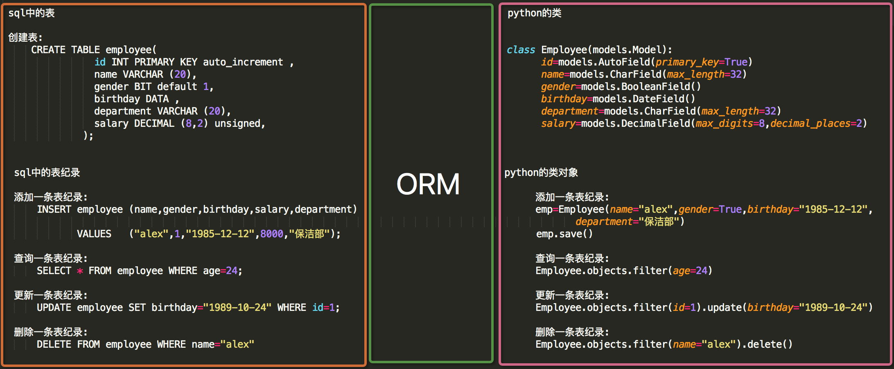

ORM添加表记录




#### sql中的表 <==对应==> python中的类

执行mysql创建表的语句，等同于在django中创建表名称的类

```python
from django.db import models

class Book(models.Model):
    id=models.AutoField(primary_key=True)
    title=models.CharField(max_length=30)
    pub_date=models.DateField()
    state=models.BooleanField()
    public=models.CharField(max_length=30)
    price=models.DecimalField(max_digits=8,decimal_places=2)
```


#### sql中的表记录 <==对应==> python中的类对象

在数据库中插入一条记录，等同于实例化表的类，创建一个对象

```python
from django.shortcuts import render,HttpResponse
from app01.models import Book

def index(request):
    book_obj=Book(id='1',title='python从入门到精通',pub_date='2014-12-5',state=True,public='人民出版社',price=82.10)
    book_obj.save()
    return HttpResponse('OK')
```


#### 插入mysql数据记录前，先要设置数据库字符集

```mysql
mysql> ALTER TABLE app01_book CONVERT TO CHARACTER SET utf8 COLLATE utf8_general_ci;
Query OK, 0 rows affected (0.12 sec)
Records: 0  Duplicates: 0  Warnings: 0
```


#### 在数据库中插入数据的方式：

##### 方式一：实例化创建表的类

```python
from django.shortcuts import render,HttpResponse
from app01.models import Book

def index(request):
    book_obj=Book(id='1',title='python从入门到精通',state=True,pub_date='2012-12-10',price=120,publish='人民出版社')
    book_obj.save()
    return HttpResponse('OK')
```


##### 方式二：创建表类下都有一个objects函数方法，是增删改查的管理器，在管理器下有create、update等方法

```python
from django.shortcuts import render,HttpResponse
from app01.models import Book

def index(request):
	#每张表下都有一个增删改查的objects的管理器,create返回值就是当前生成的对象记录
    book_obj = Book.objects.create(title='python从入门到精通',state=True,pub_date='2012-12-10',price=120,publish='人民出版社')
    #可以打印对象下的每一列的属性
    print(book_obj.title)
    print(book_obj.pub_date)
    return HttpResponse('OK')
```


顺利的在mysql中插入数据

```mysql
mysql> select * from app01_book;
+----+--------------------------+------------+-------+-----------------+-------+
| id | title                    | pub_date   | state | public          | price |
+----+--------------------------+------------+-------+-----------------+-------+
|  1 | python从入门到精通        | 2014-12-05 |     1 | 人民出版社       | 82.10 |
|  2 | Linux大师                | 2012-09-10 |     1 | 人民出版社       | 96.10 |
+----+--------------------------+------------+-------+-----------------+-------+
2 rows in set (0.00 sec)
```

