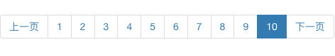

为分页器添加页码



引入bootstrap的分页，循环paginator对象的page_range属性，每循环一次，就添加一个li标签，存放当前页码

点击当前页码时，为`li`标签添加`activity`类，实现高亮状态

```html
<nav aria-label="Page navigation">
    <ul class="pagination">
        <li>
            <a href="#" aria-label="Previous">
                <span aria-hidden="true">上一页</span>
            </a>
        </li>
        <!--点击分页会向服务器发送get请求，服务器根据request.GET.get('page')得到了页码，此时判断在paginator.page_range循环的页码==用户发送请求的页码?page=3，那么就为其添加active类，高亮显示页码-->
        <!--循环paginator.page_range属性，得到每一页的页码，循环添加到li标签上-->
        
            
                <li class="active"><a href="?page={{ page_number }}">{{ page_number }}</a></li>
            
                <li><a href="?page={{ page_number }}">{{ page_number }}</a></li>
            
        
        <li>
            <a href="#" aria-label="Next">
                <span aria-hidden="true">下一页</span>
            </a>
        </li>
    </ul>
</nav>
```


