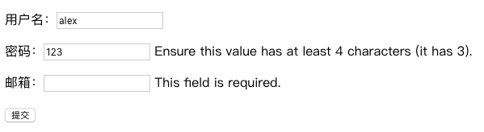

forms组件之渲染错误信息

在`get`请求和`post`请求中，都实例化了`form`对象，他们都可以在`HTML`网页中渲染生成form标签

区别是：

当为`post`请求时，渲染出的`input`标签内容，在提交后，输入的内容作为`value`值仍会保存在input标签中，这样做的好处是如果输入了大量的`input` 标签内容，但是有1、2个错误，不会因为刷新页面而丢失所有已填写的数据内容




在`HTML`网页中传入了`<span>{{ form.username.errors }}</span>`标签内容，在`get`请求时不会传入任何内容，因为`get`请求时创建的`form`对象，没有传入任何参数，且当没有错误信息form.errors时，也不会显示span标签中的错误描述

只有在`post`请求，`form`对象传入了`request.POST`数据后，且当`form.username`或其他对象有错误信息的时候，就会在span标签中显示错误信的息

```html
<!DOCTYPE html>
<html lang="en">
<head>
    <meta charset="UTF-8">
    <title>Title</title>
</head>
<body>
<!--添加novalidate后，在前段浏览器不会校验字段的规则，而是通过后台去校验-->
<form action="" novalidate>
    
    <p>
        {{ form.username.label }}：{{ form.username }}
        <!--通过form.username.errors.0输出错误描述-->
        <span>{{ form.username.errors.0 }}</span>
    </p>
    <p>
        {{ form.password.label }}：{{ form.password }}
        <span>{{ form.password.errors.0 }}</span>
    </p>
    <p>
        {{ form.email.label }}：{{ form.email }}
        <span>{{ form.email.errors.0 }}</span>
    <p>
        <input type="submit">
    </p>
</form>
</body>
</html>
```