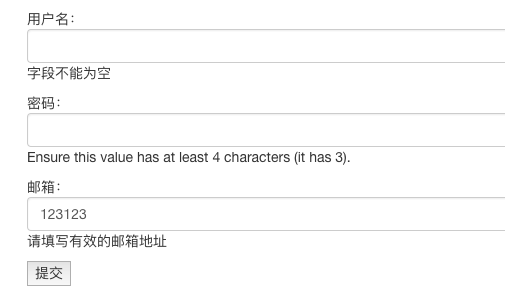

forms组件之参数配置

#### 一、渲染不同类型的input标签

`from django.forms import widgets`来实现渲染不同类型的input标签

```python
from django.forms import widgets

class UserForm(forms.Form):
    username=forms.CharField(min_length=4,label='用户名')
    # 默认生成的input表示是text类型的，通过widget=widgets.PasswordInput、CheckboxInput等来创建不同类型的input标签
    password=forms.CharField(min_length=4,label='密码',widget=widgets.PasswordInput)
    email=forms.EmailField(label='邮箱')
```


#### 二、自定义input标签的属性

可以通过`widget=widgets.TextInput(attrs={'class':'form-control'})`属性，来实现控制标签的各个属性值，如`class`、`id`、`name`等

```python
class UserForm(forms.Form):
    username=forms.CharField(
        min_length=4,label='用户名',
        error_messages={'required':'字段不能为空'},
        # 在TextInput中添加attrs={'标签属性':'属性值'}来自定义标签属性
        widget=widgets.TextInput(attrs={'class':'form-control'})
    )
```


#### 三、错误描述参数配置

在forms校验类定义的字段中，添加`error_messages={'key':'错误描述'}`来实现展示自定义错误信息，key的值是固定的，如`required`、`invalid`

```python
class UserForm(forms.Form):
    username=forms.CharField(min_length=4,label='用户名',error_messages={'required':'字段不能为空'})
    password=forms.CharField(min_length=4,label='密码',widget=widgets.PasswordInput)
    email=forms.EmailField(label='邮箱',error_messages={'invalid':'请填写有效的邮箱地址'})
```

错误描述展示：


