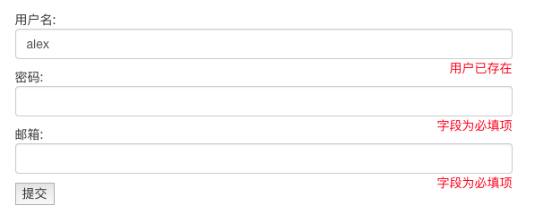

`is_valid`是对字段进行校验的方法

```python
def register(request):
    if request.method=='POST':
        # 根据校验类实例化form对象，is_valid()是对字段进行校验的方法
        form=UserForm(request.POST)
        if form.is_valid():
            print(form.cleaned_data)
```


查看`is_valid`方法源码

```python
def is_valid(self):
	"""Return True if the form has no errors, or False otherwise."""
	return self.is_bound and not self.errors
```


通过注释语句可以看到：

**`errors`中没有错误，返回`True`**

**`errors`中有错误，返回`Falser`**


查看errors方法源码：

```python
@property
def errors(self):
    """Return an ErrorDict for the data provided for the form."""
    if self._errors is None:
        self.full_clean()
        return self._errors
```


`full_clean`方法中有`self._clean_fields()`校验字段方法

```python
    def _clean_fields(self):
        # fields.items()字典{'username':规则对象，'password':'规则对象'}
        # 规则对象是校验类UserForm类中每个字段定义的规则，form.CharField(min_length...)
        for name, field in self.fields.items():
            if field.disabled:
                value = self.get_initial_for_field(field, name)
            else:
                value = field.widget.value_from_datadict(self.data, self.files, self.add_prefix(name))
            try:
                if isinstance(field, FileField):
                    initial = self.get_initial_for_field(field, name)
                    value = field.clean(value, initial)
                else:
                    # 如果用户输入的value值，校验成功，会返还value原值，并把值放入到cleaned_data字典中，存放校验规则成功的数据
                    value = field.clean(value)
                self.cleaned_data[name] = value
                # 循环的name表示每个字段的名称，如果校验类中存在clean_username的方法，执行该方法内的钩子函数，并再次把校验成功的值放入cleaned_data字典中
                if hasattr(self, 'clean_%s' % name):
                    value = getattr(self, 'clean_%s' % name)()
                    self.cleaned_data[name] = value
            # 如果在校验的过程中，字段值不匹配规则，字段名和错误描述放入errors字典中
            except ValidationError as e:
                self.add_error(name, e)
```


所以在校验类中添加钩子函数，不仅对字段执行校验类定义的规则，如min_length、EmailField等，还会对该字段的clean_name方法进行校验，校验的是从校验正确的cleaned_data字段中取出的value值，对这个value值进行一系列的其他校验

```python
def clean_name(self):
	# 获取源码中经过第一层校验，将匹配规则对象的value放入cleaned_data字典中
	val=self.cleaned_data.get('name')
    
    # 使用用户输入的内容进行SQL查询
	ret=User.objects.filter(name=val)
	
    # 如果查询到数据，就直接返回数据，如果没有查询到则报异常ValidtionError异常，吻合和源码中的ValidtionError异常
	if not ret:
		return val
	else:
		raise ValidationError('用户已存在')
```

此时不仅会验证字段规则，还会执行钩子函数的验证规则：



## 但是局部钩子只能校验单一的一个字段