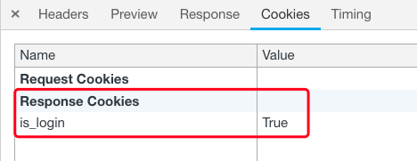
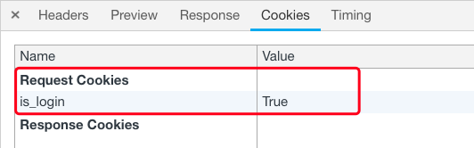

**主要涉及的方法：**

响应体(HttpRespone、render、redirect).set_cookie('login',True)

request.COOKIE.get()

delete_cookie()

在登录页如果校验用户名和密码成功，则创建响应体对象`response`，并为响应体`set_cookie`设置cookie

```python
def login(request):
    if request.method=='POST':
        form=UserForm(request.POST)
	    
        username=request.POST.get('username')
        password=request.POST.get('password')
		
        # 只要编写了form.is_valid()就会调用forms的校验类，执行UserForm中的代码，进行规则对象的校验，以及局部钩子和全局钩子的校验，且会对form(request.POST)中传入的数据进行校验，如果不存在定义的字段如username、password等is_valid()方法就会变为false！！！此时会判断是否校验成功，校验成功，也就是登录成功后，才会返回指index页面，并设置cookie
        if form.is_valid():
            user_obj = User.objects.filter(username=username, password=password).first()

            response=redirect('/index/')
            response.set_cookie('login',True)
            response.set_cookie('username',user_obj.username)
            return response
        # 如果没有校验成功，如果有全局错误，就读取全局错误信息，返回至登录页面，而不是登录成功的index页面，并设置了login的cookie为False
        else:
            error=form.errors.get('__all__')
            response=render(request,'login.html',locals())
            response.set_cookie('login',False)
            return response
```


登录成功后，服务器返回响应数据“登录成功”，并在`Response Cookies`中设置了cookie信息`is_login=True`



此时发送请求访问index页面，浏览器响应头中仍保存着cookie信息，但这次是在`Request Cookies`中，因为index视图函数中，并没有操作cookie信息，所以响应体中不包含cookie信息



访问其他页面时，读取cookie信息`request.COOKIES.get('is_login')`，如果有is_login的cookie，那么就为用户返回index页面，否则将跳转回login页面，使用其他浏览器访问时，由于没有cookie信息，会直接重定向到login页面

```python
def index(request):
    # {'is_login': 'True'}
    print(request.COOKIES)
	
    # 读取cookie信息
    is_login=request.COOKIES.get('is_login')
    # 在视图函数中设置了set_cookie('username',user_obj.username)，在其他视图函数中读取出来，发送到HTML网页后可以通过HI，{{ username }}实现打印HI，alex
	username=request.COOKIES.get('username')

    if is_login:
        return render(request,'index.html')
    else:
        return redirect('/login/')
```


**切换不同的用户登录，`{'login':True}`会被覆盖，因为只要一登陆成功就会设置cookie为``{'login':True}``，所以一个浏览器针对一个服务器只有一个同key的cookie**