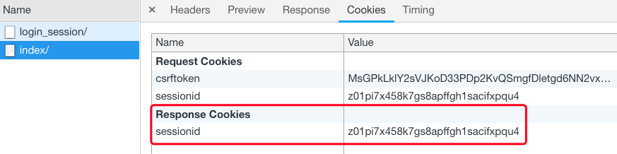
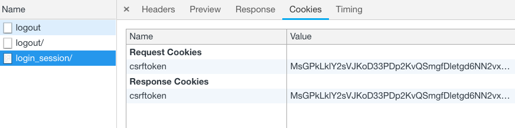
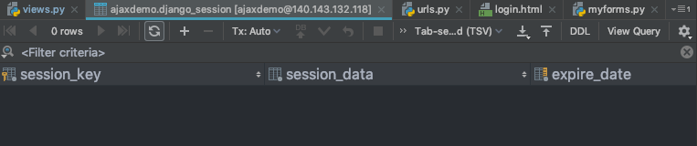

session注销

删除session字段中的某个键值

`del request.session[key]`


删除当前回话下的所有session信息

`request.session.fulsh()`


**底层实现：**

1、获取sessionid的cookie值，结果是一个随机字符串

```python
session_key=request.COOKIES.get('sessionid')
```

2、通过session_key在django_session表中过滤数据，并删除

```python
django_session.objects.filter(session_key=session_key).delete()
```

3、删除sessionid的cookie值：delete_cookie

```python
response.delete_cookie('sessionid')
```


**代码逻辑：**

```python
def logout(request):
    # del方法可以删除session_data字典中的某个键值，如{'is_login':True,'username':'alex'}
    del request.session['is_login']

    # flush方法可以完全删除当前回话的session数据
    request.session.flush()

    return redirect('/login_session/')
```


登录成功后，服务器设置了session




注销后，重新返回登录页面，服务器删除了当前回话的所有session信息，并清除了`sessionid`的`cookie`




同时在`django_session`表中也清除了数据

