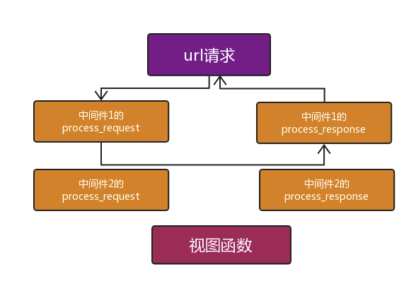
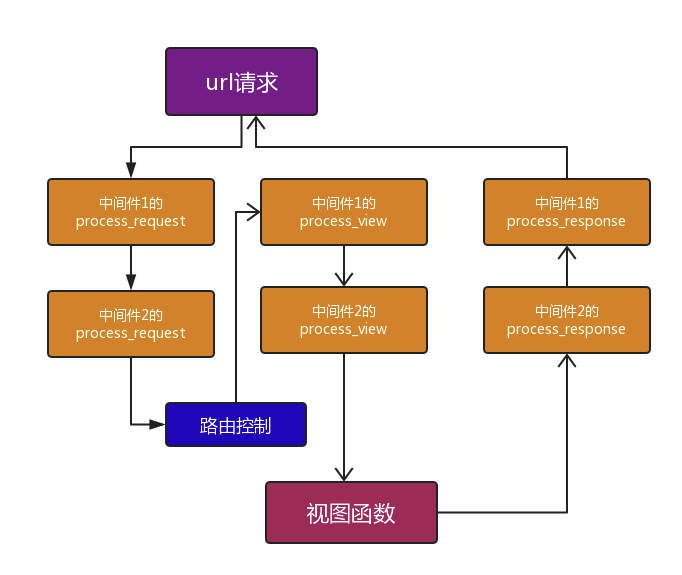

自定义中间件类


**process_request**和**process_response**


每一个中间件就是一个`class`类，在类中定义`process_request`和`process_response`方法，运行程序后浏览器请求访问每一个路径时，都会执行**每**一层中间件的`process_request`方法，同样在视图函数返回响应体后，也会执行**每**一层中间件的`process_response`方法

```python
from django.utils.deprecation import MiddlewareMixin

class MiddleWare_1(MiddlewareMixin):

    def process_request(self,request):
        print('MiddleWare_1 to request')

    def process_response(self,request,response):
        print('MiddleWare_1 to response')
	    # 在process_response中必须有return response，传递的是视图函数中返回的响应体，如果视图函数报错了，那么返回的是process_exception中的响应体
        return response

class MiddleWare_2(MiddlewareMixin):

    def process_request(self,request):
        print('MiddleWare_2 to request')

    def process_response(self,request,response):
        print('MiddleWare_2 to response')

        return response
```

**查看程序输出：**

```python
# 执行中间件的请求过程是按照settings.py文件中的引入顺序执行process.request方法，返回响应体时的执行顺序是倒序，从最后开始执行
MiddleWare_1 to request
MiddleWare_2 to request
MiddleWare_2 to response
MiddleWare_1 to response
```


注：如果在process_request中添加return，就不会执行其他中间件类，会直接执行当前中间件的process_response方法返回响应体，不会再去执行其他中间件的方法




**process_view**

添加`process_view`后，依次执行所有中间件中的`process_request`方法，执行完毕后，在路由分发`url.py`中执行指定视图函数代码行`path('login/', views.login),`，再继续执行所有中间件的`process_view`方法，执行完毕后，然后执行视图函数代码，最后倒序执行所有中间件的`process_response`方法



```python
from django.utils.deprecation import MiddlewareMixin
from django.shortcuts import HttpResponse

class MiddleWare_1(MiddlewareMixin):

    def process_request(self,request):
        print('MiddleWare_1 to request')
        
	#process_view函数
    def process_view(self,request, callback, callback_args, callback_kwargs):
        # 调用callback()，相当于调用了访问的视图函数
        callback(request)
        print('MiddleWare_1 to view')
        
        # 如果在view中添加返回内容，执行至此时，不会执行视图函数，和其他中间件中的view代码，直接倒序执行所有中间件的response方法
        return HttpResponse('view')

    def process_response(self,request,response):
        print('MiddleWare_1 to response')

        return response

class MiddleWare_2(MiddlewareMixin):

    def process_request(self,request):
        print('MiddleWare_2 to request')
	
    #process_view函数
    def process_view(self,request, callback, callback_args, callback_kwargs):
        print('MiddleWare_2 to view')

    def process_response(self,request,response):
        print('MiddleWare_2 to response')

        return response
```

**查看程序输出：**

```
MiddleWare_1 to request
MiddleWare_2 to request
MiddleWare_1 to view
MiddleWare_2 to response
MiddleWare_1 to response
```


具体的实际应用，会在以后读取源码时讲解