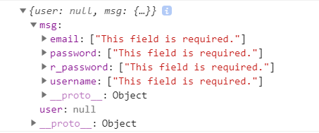

1、如何引入`BeautifulSoup`模块

```python
from bs4 import BeautifulSoup
```


2、`soup.find_all()`的结果内容是什么样的

```
结果是一个列表，存储的是网页元素中的每一个标签对象
```


2、如何通过创建`soup`对象，并通过`BeautifulSoup`模块检查非法标签

```python
soup = BeautifulSoup(content_text,'lxml')

for tag in soup.find_all():
    if tag.name == 'script':
    tag.decompose()	
```


3、循环`soup.find_all()`的`tag`标签，它的`name`属性是什么？

```
存储的是每一个标签对象的名称
```


4、`soup`对象的内容是什么样的？包含哪些内容

```
soup对象是同时包含网页的文本和标签
```


6、如果要对包含标签和文章内容的文本，截取出部分文章概要，怎么做

```python
soup = BeautifulSoup(content_text,'html.parser')
# 对文本内容进行切片
html_text = soup.text[:150]
```


7、如何实现简单的`socket`服务端和客户端通信，并一直支持接收并返回消息

服务端：

```python
import socket

server = socket.socket(socket.AF_INET,socket.SOCK_STREAM)
server.setsockopt(socket.SOL_SOCKET,socket.SO_REUSEADDR,1)
server.bind(('127.0.0.1',8080))
server.listen(5)

while True:
    conn, caddr = server.accept()

    while True:
        data = conn.recv(1024)
        conn.send(data.upper())
```

客户端：

```python
import socket

client = socket.socket(socket.AF_INET, socket.SOCK_STREAM)
client.connect(('127.0.0.1',8080))

while 1:
    data = input('>>>:')
    if not data:
        continue
    client.send(data.encode('utf-8'))
    data = client.recv(1024)
    print(data)
```


5、在浏览器的什么位置可以查看到服务器反馈的响应体和渲染后页面

6、什么是超文本传输协议，他是基于哪一个应用层的，可以保存用户的状态吗

```
Hyper Text Transfer Protocol超文本传输协议，基于TCP/IP的应用层协议，就是服务端与客户端传输超文本标记语言HTML的协议，由客户端发送请求，服务端返回响应体
```

7、`get`请求和`post`请求在哪获取请求参数

8、`get`和`post`请求有长度限制吗

9、请求头中的`keep-alive`是什么意思

10、`connect-length:16`是什么意思

11、服务器如何返回响应体

12、`post`请求报文中请求头和请求体是如何分隔的

13、响应状态码，1-5开头分表表示什么意思

14、`wsgiref`模块是做什么用的，如何使用

```
Web Server Gateway Interface：web应用程序、web服务、web框架之间的一种接口，可以解析HTTP请求，可以封装HTTP响应
```


15、浏览器请求的`/favicon`是做什么用的，应当返回什么数据，每次请求都会请求这个路径吗

16、网页中的图标一般存放在`html`代码中的什么位置

17、如何使用`pymysql`模块，如何插入一条数据和插入多条数据，如何提交数据，如何获取结果

```python
import pymysql

conn = pymysql.connect(
    host='140.143.132.118',
    port=3306,
    user='xiaoxin',
    password='Nishi458_2',
    db='blog',
    charset='utf8'
)

cursor = conn.cursor()

sql = 'select username from blog_userinfo where username = %s'

ret = cursor.execute(sql,('alex'))
print(cursor.fetchone())
print(cursor.fetchall())

sql = 'insert into user(id, name) values(%s,%s)'

ret = cursor.executemany(sql, [(1,'alex'),(2,'wangxin')])
conn.commit()
```


18、什么是`Django`的`MVC`模型，`MTV`模型

19、如何下载和安装`Django`，使用的什么版本

20、如何通过命令创建`Django`项目

```python
django-admin.py startproject mysites
```


21、如何通过命令创建`Django`应用

```
python3 manage.py startapp blog
```


22、没有`templates`文件夹怎么办
23、如何启动`django`项目，不指定端口号，默认是什么

```
python3 manage.py runserver 8865
```


24、路由分发`urls.py`文件中的变量是什么，如何编写

```
urlpatterns = [
    
]
```


25、如何实现在`Django`项目中配置静态文件目录`static`，如何读取

```
1、在settings.py中添加:
STATIC_URLS = 'static'
STATIC_FILES = os.path.join(BASE_ORG, 'static')

2、通过/static/...来读取static文件夹下的文件
```


26、在哪引入`path、re_path、include`

```
from django.urls import path,re_path,include,reverse
```


27、在哪引入`render、HttpResponse、redirect`

```
from django.shortcuts import render,HttpResponse,redirect
```


28、分组正则表达式的处理逻辑是怎样的

```
（?P<username>.*）
```


29、如何实现将路由分发到应用下的路由分发

```
path('login/', include('app01.urls'))
```


30、提交`form`表单如果`action`属性没有填写，表示什么，`ajax`的`url`如果没有填写表示什么
31、在视图函数中如何获取`get`和`post`请求参数
32、如何在视图函数中知道当前的请求方式？
33、在路由分发中，如何为路径设置别名？在模板中如何调用别名路径

```
path('login', views.login, name = 'Login')


```


34、如何在视图函数中反向解析出路由分发中的别名路径

```
from django.urls import reverse
url = reverse('Login')
```


35、`queryset`是什么数据类型，他是什么样的

```python
# 列表的形式，存储每一个字典，列名：列值
<QuerySet [{'name': 'alex'}, {'name': 'egon'}]>
```


36、`path`方法如何使用转换器，有哪几种

```python
path('login/<str:year>', views.login)
path('login/<int:age>', views.login)
path('login/<slug:username>', views.login)
path('login/<uuid:id>', views.login)
path('login/<path:name>', views.login)
```


37、`form`表单中`action`属性为`/index/`表示什么

38、如何通过`request`打印请求路径，如何打印请求路径+get参数

39、如何通过`request`打印编码方式，该属性可写吗

```
request.encoding
```


40、如何通过`request`打印所有的请求头信息

```
request.META
```


41、如何通过`request`打印所有的`cookies`信息

```
request.COOKIES
```


42、`render`方法的底层原理是什么，如何使用

```pythoN
打开一个文件后，返回
return render(request,'login.html',locals())
```


43、在`render`方法中如何返回数据，有哪两种方式

```
locals()
{'name':name,'age':age}
```


44、模板过滤器在哪调用，其中`default、length、filesizeformat、date、slice、truncatechars、truncatewords、safe、add`分别表示什么意思，其中safe过滤器是什么原理

```html
<!DOCTYPE html>
<html lang="en">
<head>
    <meta charset="UTF-8">
    <title>Title</title>
</head>
<body>
    <!--default过滤器，当列表数据为空，传入HTML网页时，使用default过滤器，为空序列数据添加默认数据-->
    <p>{{ s|default:'序列数据为空' }}</p>
    <!--length过滤器，打印列表或字符串的长度-->
    <p>{{ l|length }}</p>
    <p>{{ str|length }}</p>
    <!--filesizeformat过滤器，根据数值长度，打印数值对应的数据长度，如991.3KB-->
    <p>{{ a|filesizeformat }}</p>
    <!--date过滤器，根据时间对象，按格式打印时间，2018-10-28-->
    <p>{{ now|date:'Y-m-d' }}</p>
    <!--slice过滤器，字符串切片，打印llo world-->
    <p>{{ str|slice:"2:" }}</p>
    <!--truncatechars过滤器，如果文本内容较长，截断内容显示为hel...，包含...的长度-->
    <p>{{ content|truncatechars:6 }}</p>
    <!--打印hello every,good morning,Let's ...，按单词截断-->
    <p>{{ content|truncatewords:3 }}</p>
    <!--safe过滤器，为了保护数据安全，因为如果写入<script></script>的话，这段代码存入数据库后，会对当前页面造成插入代码，传入的字符串内容包含标签时，Django为了保护数据，会将传入的标签内容显示为字符串，失去了标签的展示意义，所以添加safe过滤器，直接以标签的含义展示内容-->
    <p>{{ link|safe }}</p>
    <!--add过滤器，把数据+100-->
    <p>{{ a|add:100 }}</p>
</body>
</html>
```


45、模板标签有哪几种

46、如何自定义标签过滤器，如何调用

```
1、在应用下新建templatetags文件夹
2、创建文件如my_filter.py
3、from django import template
4、register = template.Library()
5、定义函数
@register.filter
def multipl(x,y):
	return x*y
6、{{ length | mutipl:2 }}
```


47、如何自定义模板标签，如何调用

```
1、在应用下新建templatetags文件夹
2、创建文件如my_filter.py
3、from django import template
4、register = template.Library()
5、定义函数
@register.simple_tag
def multipl(x,y):
	return x*y
6、


```


48、`include`模板标签继承和`extends`模板标签继承如何使用，`extends`标签有什么使用要求

```html




<!--可以在预留的block中重写父类的方法-->


<title>order</title>
<!--为block盒子结束符添加名字-->

```


49、如何在`block`标签中调用父级盒子中的内容

```

   <title>panel</title>



	{{ block.super }}

```


50、`ORM`创建表时，创建表就相当于什么？，需要继承于哪个类

```python
from django.db import models

class Aritcle(modles.Model):
	pass
```


51、创建表时，支持哪些数据类型的列，分别表示什么意思

```
CharField
IntegerField
DateField
EmailField
BooleanField
AutoField
DecimalField
FileField
DateTimeField
TextField
```


52、如何设置为该列为主键列

```python
models.AutoField(primary_key = True)
```


53、如何设置该列的最大长度

```python
models.AutoField(max_length = 100, primary_key = True)
```


54、在有小数点的数值类型中，如何设置一共有几位数值，小数点有几位

```python
models.DecimalField(max_digits = 5, decimal_places = 2)
```


55、`Django`如何在`settings.py`中设置数据库连接信息

```python
DATABASES = {
    'default': {
        'HOST': '140.143.132.118',
        'PORT': 3306,
        'USER': 'xiaoxin',
        'PASSWORD': '123456',
        'NAME': 'blog',
        'ENGINE': 'django.db.backends.mysql'
    }
}
```


56、连接数据库时，在哪注册当前应用？

```
settings.py中的INSTALLED_APPS = [
    
]
```


57、`Django`创建表时，都需要做哪4步必做配置，1步可选操作

```python
1、在settings.py的INSTALL_APPS列表中注册应用
2、在settings.py中配置数据库连接信息
3、在项目的__init__.py中:
import pymysql
pymysql.install_as_MySQLdb()
4、执行：
python3 manage.py makemigrations
python3 manage.py migrate
```


58、如何在`ORM`中新增一条表记录

```
Article.objects.create(username=xxx, password=xxx)
```


59、如何查询该表中所有的记录

```
Article.objects.all()
```


60、如何查询该表中的第一条记录和最后一条记录

```
Article.objects.all().first()
Article.objects.all().last()
```


61、如何在表中过滤数据，有哪两种方法

```python
user = UserInfo.objects.filter(username=username).first()
user = UserInfo.objects.get(username = username)
```


62、如何查询过滤条件以外的数据

```python
article.objects.exclude(title='python从入门到精通')
```


63、如何在`ORM`语句中升序和降序排序

```python
article.objects.all().order_by('price')
article.objects.all().order_by('-price')
```


64、如何倒序输出所有查询结果

```
article.objects.all().reverse()
```


65、如何统计查询结果的总数

```
article.objects.all().count()
```


66、如何判断当前查询结果是否存在

```
article.objects.all().exists()
```


67、`values`和`values_list`的查询结果有什么不同

```python
Blog.objects.all().values('title') 
#输出结果是列表，列表中存储每一个个的字典，字典中包含表中每一条记录的【列名：列值】
<QuerySet [{'nid': 1, 'title': 'alex的个人空间', 'site_name': 'alex的新大陆', 'theme': 'alex.css'}, {'nid': 3, 'title': 'wangxin的个人空me': 'wangxin的站点', 'theme': 'wangxin.css'}]>


article.objects.all().values_list('title') 
#输出结果是列表，列表中存储每一个个的元祖，元祖中存储表中每一条记录的【列值】
<QuerySet [(1, 'alex的个人空间', 'alex的新大陆', 'alex.css'), (3, 'wangxin的个人空间', 'wangxin的站点', 'wangxin.css')]>

```


68、如何调用去重方法，怎样去重才有意义

```python
#与values配合才有意义，针对某一列去重
article.objects.all().values('price').distinct()
```


69、什么是链式查询
70、`ORM`模糊查询__支持哪6种语法，在哪使用，他们都表示什么意思，针对时间列有哪2种模糊查询语法

```python
__gt大于
Article.objects.filter(price__lg=150)

__lt小于
Article.objects.filter(price__lt=100)

__startswith
Aritcle.objects.filter(title__startswith='小')

__contains
__in = []在什么范围之内
Article.objects.filter(price__in = [100,150])

__year,__month
Article.objects.filter(pub_time__year=2011,pub_time__month=9)
```


71、`ORM`如何删除和修改数据

```python
Article.objects.filter(title='小红帽').update(title='小松鼠')

Article.objects.filter(title='大灰狼').delete()
```


72、如何重定向一个页面

```python
from shortcuts import redirect
# 填写路径
return redirect('/book/')
```


73、`bootstrap`提供了哪些将元素和图片左右浮动的方法，实现了什么效果

```
media-right
media-left
pull-right
pull-left
```


74、`HTML`网页中`select`标签，传入`request.POST`中的是一个列表，那么如何通过`ORM`取值

```
request.POST.get_list('habbies')
如果使用request.POST.get()那么得到的是列表最后一个值
```


75、在模板文件中，`forloop`提供了哪些方法

```python
{{ forloop.counter }} #循环计数
 #循环中最后一次循环
```


76、为什么要将多类信息分散到不同的表结构中

```
解耦
```


77、一对多关系如何创建表关系

```python
public = models.ForeignKey(to='public', to_field='nid')
```


78、多对多关系如何创建表关系

```python
# 多对多关系在哪张表中创建关系都是可以的，比如在书籍表中创建
authors=models.ManyToManyField(
		to=Author,
        through='Book2Author',
        through_fields=('book','author')
)

class Book(models.Model):
    authors=models.ManyToManyField(to='Author')
```


79、创建表时，每一个字段的`verbose_name`表示什么意思

```
1、可以简明的查看到当前字段什么意思
2、在django后台管理页面，将每个字段以中文显示
```


79、一对一关系如何创建表关系

```python
class UserInfo:
	blog=models.OneToOneField(to='Blog',to_field='nid',null=True)
```


80、`ORM`如何实现外键列，外键列生成后是什么样的

```
外键列生成后会自动添加_id标识，如变为blog_id
```


81、创建一条记录时，一对多关系的外键列如何指定列值，有哪两种方式

```python
# 1、直接指定外键列值
book_obj=Book.objects.create(title='水浒传',price=199,publishDate='2012-9-8',publish_id=1)

# 2、将查询出的对象，作为外键值
	publish_obj=Publish.objects.get(name='北京出版社')
    book_obj=Book.objects.create(title='三国演义',price=82,publishDate='2012-5-12',publish=publish_obj)
```


82、如何通过外键列查询外键表中的列值

```python
# 通过外键对象，查询出外键表的列值    
    book_obj = Book.objects.filter(name="小红帽")
    print(book_obj.publish.name)
```


82、在创建表结构时，如果没有指定多对多关系的`through`属性，那么会自动生成关系表吗

```python
# 会自动生成，through是指定多对多关系的表名，through_filed表示多对多关系的约束列，值为元祖
tags=models.ManyToManyField(
    to=Tag,
    # through中间模型，不自动生成多对多关系表，使用手动创建的关系表
    through='Article2Tag',
    # 设置多对多的关系列，article列和tag列相互约束
    through_fields=('article','tag')
)

或

class Book(models.Model):
    authors=models.ManyToManyField(to='Author')
```


83、多对多关系表如何插入数据，是根据哪个字段插入的，它提供了哪些添加、移除、清除接口，分别代表什么意思

```python
 	alex=Author.objects.get(name='alex')
    egon=Author.objects.get(name='egon')

    # 按作者对象alex，egon
    book_obj.authors.add(alex,egon)
    # 按nid为1和2的作者
    book_obj.authors.add(1,2)
    # 传入非固定参数
    book_obj.authors.add(*[1,2])
    
    
    book_obj.authors.remove(alex,egon)
    book_obj.authors.remove(1,2)
    book_obj.authors.remove(*[1,2])
    
    # clear()方法，在关系表中清除所有与这本书关联的作者数据
    book_obj.authors.clear()
    
    # 在关系表中查询出所有与这本书关联的作者对象，返回是queryset类型的列表
    print(book_obj.authors.all())
```


84、面向对象和双下划线的查询方法是基于`mysql`中的什么查询

```
面向对象是基于子查询
基于双下划线是基于join跨表查询
```


85、按对象查询是由谁调用，基于双下划线是由谁调用

```
基于对象的调用者是表名接口，如Book，Ariticle
基于双下划线的调用者是在filter和values中使用，如（book__title）
```


86、面向对象的正向查询按什么，反向查询按什么，调用者是谁

```
正向查询按字段，反向查询按表名
调用者是表名接口，如Book，Article等，Book.authors.name
书籍和出版社的关系是一对多关系，在多的书籍表中创建关系列，在创建表时字段是包含在类中的
```


87、基于双下划线的正向查询按什么，反向查询按什么，调用者是谁，在哪使用

```
正向查询按字段，反向查询按表名
调用者是在filter和values中使用。如filter(author__name,book__title)
```


88、`aggregate `什么意思，返回的结果是什么样的

```python
# aggregate 美 /'æɡrɪɡət 集合，聚集
# 在其中可以使用aggregate调用聚合函数查询，返回的结果是字典形式，列名：列值
Book.objects.all().aggregate(Avg('price'),Max('price'),Min('price'),Count('price'))
```


89、聚合函数有哪5种，如何引用，如何使用

```python
from django.db.models import Avg, Max, Min, Count, Sum
Count、Avg、Max、Min、Sum
```


90、如何在分组查询时使用聚合函数，如何展示结果

```python
Book.objects.values('title').annotate(count_price=Count('price')).values('title','count_price')
```


91、`Book.objects.all().annotate()`与`Book.objects.annotate()`意义一样吗？为什么

```
一样，都包含主键,在官方文档中有时会遇到Book.objects.all().annotate()
```


91、如何添加表字段

```pythoN
# 执行python3 manage.py makemigrations时出现
Please select a fix:
 1) Provide a one-off default now (will be set on all existing rows with a null value for this column)
 2) Quit, and let me add a default in models.py
# 选择1，系统提示Please enter the default value now, as valid Python：请为新增字段添加一个默认值，输入一个默认值>>> 0，后确定
# 再执行python3 manage.py migrate即成功添加列
```


92、如何使用F查询，F查询时做什么用途的，有哪两种情况

```python
# 1、列值间相互比较
Book.objects.filter(comment_num__gt=F('read_num'))
# 2、列值数学运算
Book.objects.update(price=F('price')+1)
```


93、如何调用Q查询，Q查询时做什么用途的

```python
# Q查询是在filter方法中做与、或、非查询，连接查询条件
Book.objects.filter(Q(title='西游记') & Q(price=200))

Book.objects.filter(Q(title='西游记')|Q(title='红楼梦'))

Book.objects.filter(~Q(title='西游记'))
```


94、`jquery`的`ajax`是做什么用的？如何编写，有哪些参数，返回的数据如何处理

```javascript
$.ajax({
    url: '',
    type:'get/post'，
    data:{
        'username':$('.username').val()
    }
    success:function(data){
        $('#ret').val(data)
    }
})
```


95、如果`ajax`的`success`中单纯接收一个视图函返回的字典，如何处理，通过什么方法返回字典就无需此操作了

```
两个编程语言间传递json参数时，需要先dumps序列化为字符串后才能传递，在HTML中通过JSON.parse反序列化为Object类型，JSON.parse(data)反序列化为json数据
```


96、基于`form`表单如何上传文件，需要添加什么属性，不添加会怎样

```python
# 如果没有添加ectype，那么在request.FILES中无法获取到值
<form action="" method="post" enctype="multipart/form-data">
        用户名<input type="text" name="username">
        头像 <input type="file" name="upload">
        <input type="submit">
</form>
```


97、`ajax`中如何发送序列化的`data`数据，调用什么方法

```python
# 在JSON.stringify({key:value},{key:value})中将object类型序列化为字符串
data: JSON.stringify({
    username:$('[name=username]').val(),
    password:$('[name=password]').val()
})
# 在视图函数中通过json.load(request.body)来获取json数据
userinfo=json.loads(request.body)
```


98、如何通过`ajax`上传文件

```python
 $('#register').click(function(){
            #写在JS事件中，如果写在外面视图函数将接收不到任何参数
            #之所以用formdata，是因为要发送文件数据
            var formdata = new FormData();
            #将发送的数据和文件以formdata.append(key，value)的形式添加
            formdata.append("username",$('[name=username]').val());
            formdata.append("password",$('[name=password]').val());
            #jquery对象[0]获取JS对象.files[0]在列表中获取文件对象
            formdata.append("pic",$('[name=pic]')[0].files[0]);
            $.ajax({
                url:'',
                type: "post",
                #如果不添加如下两句，将会报错Uncaught TypeError: Illegal invocation，分别表示不对数据进行编码，和不做预处理
                contentType:false,
                processData:false,
                #数据仍然是通过Ajax发送出去
                data: formdata,
                success:function(data){
                    console.log(data)
                }
            })
        })
```


99、`ORM`中如何批量的插入数据g

```python
# 创建一个空列表
book_list=[]
# 循环创建ORM对象，使用Book(title=xxx)，而不是Book.object.create()去创建
book_obj=Book(title="book_%s"%i,price=i)
# 并将对象添加到列表中
book_list.append(book_obj)
# 调用bulk_create（列表）批量添加数据
Book.objects.bulk_create(book_list)
```


100、`django`如何实现自动分页的效果，需要引入什么类，创建分页对象时都需要传入哪两个参数？分别表示什么意思？

```python
from django.core.paginator import Paginator

book_list = Book.objects.all()

paginator = Paginator(book_list,10)
```


101、创建的分页对象包含哪3个属性

```python
# 展示传入的列表，一共有多少条数据
paginator.count

# 每页10条数据的话，那么会被分为几页展示
paginator.num_pages

# 得到range(1,11)，得到页码列表
paginator.page_range()
```


102、在前端页面点击每一页的页码时是`get`请求，传入后台页码参数，如何得到这一页的数据？

```python
# 先通过得到请求页码
request_page_num = request.GET.get('page')
# 再得到这一页的所有数据列表
book_list = request.page(request_page_num)
```


102、如果用户在页数请求写入不存在的参数-1时，会报错，怎么解决

```python
# 把当前页设置为第一页，展示第一页数据
from django.core.paginator import EmptyPage

try:
	request_page_num = request.GET.get('page')
	book_list = request.page(request_page_num)
except EmptyPage:
	book_list = request.page(1)
```


103、如何通过数据列表在前端展示数据？

```python
# 可以循环列表，得到书籍对象

	{{ book.title }}

```


104、如何展示分页的页码？

```python
# 分页的控件是使用的bootstrap的分页标签
# 通过循环paginator.page_range页码列表，来展示分页页码
# 且如果分页页码==当前请求的页码，那么就为其添加上active的类，高亮显示


	
		<li class="active"><a href="?page={{ page_number }}">{{ page_number }}</a></li>
	
		<li><a href="?page={{ page_number }}">{{ page_number }}</a></li>
	

```


105、如何使用上一页和下一页标签按钮

```
当前页对象拥有has_previous和has_next方法，判断是否还有上一页和下一页页码，如果有则把上一页标签的链接变为{{ current_page.previous_page_number }}和{{ current_page.next_page_number }}
```


106、如何调整分页的显示样式，而不是显示所有的页码呢

```
如果页码很多的话，判断当前页数，一共想显示多少页

if当前页码-5如果<0，那么paginator.page_range=range(1,11)

elif当前页码+5大于paginator.num_page最大页数，则：
paginator.page_range(paginator.num_page-10,paginator.num_page)

else
paginator.page_range(current_page_num-5,current_page_num+5)
```


102、从哪引入forms组件，它的作用是什么

```python
from django import forms
# 用于在创建校验类时，所继承的父类
class UserInfo(froms.Form)
```


103、如何创建forms校验类，它的变量名什么要求

```python
class UserInfo(forms.Form):
	# 校验字段名，必须和html中标签的name值一致
	username = forms.CharField()
```


104、如何在form校验类中为标签指定label值

```python
在校验字段中添加label属性
class UserForm(forms.Form):
    # 定义的所有变量必须和HTML的form表单中的name匹配，才会去进行验证，如username匹配form表单中name=username的用户名字段;min_length表示最小长度
    # 添加label参数，可在form表单中通过form对象.变量名.label读取出字段的名称
    username=forms.CharField(min_length=4,label='用户名')
    password=forms.CharField(min_length=4,label='密码')
    email=forms.EmailField()
```


105、在get和post请求中，如何分别创建form对象

```
1、引入校验类
2、创建对象
get方法内：
form = UserForm()

post方法内：
form = UserForm(request.POST)
```


106、调用什么方法可以在视图函数中通过form对象校验字段，调用该方法时执行了哪些操作，它的返回值是什么

```
调用form.is_valid()方法后，会根据request.POST传入的参数在校验类中进行校验，返回值是True和False
```


107、校验成功的结果和失败的结果，分别存放在什么位置

```python
如果is_valid()方法所有字段校验成功，那么所有字段均存储在form.cleaned_data中，字典形式，展示为{'username': 'alex', 'password': '1234', 'email': '1234@qq.com'}
如果校验失败，那么校验成功的字段仍存储在from.cleaned_data中，校验失败的字段存储在form.errors中，展示为
ErrorDict,{'name':[错误描述信息]}
```


108、form.errors是什么样的




108、如何在错误的结果中取出错误的详细信息，如何将其添加到对应的标签

```python
# 由于from.errors是字典类型，所以通过from.errors.get('username')[0]取出错误描述

# 只要编写了form.is_valid()就会调用forms的校验类，执行UserForm中的代码，进行规则对象的校验，以及局部钩子和全局钩子的校验，且会对form(request.POST)中传入的数据进行校验，如果不存在定义的字段如username、password等is_valid()方法就会变为false

可以在渲染标签时

	<div class="form-group">
    	{{ field.label }}:{{ field }}
        # 只有在添加.0后，才完整显示错误内容，否则显示为“·用户不存在”，有个点
        <span class="has-error pull-right">{{ field.errors.0 }}</span>
    </div>
```


109、如何在HTML网页中通过form对象渲染标签

```python
# 通过在html网页中循环form对象，循环的结果是每一个校验字段对象，拥有label属性，每一个对象展示出from表单

    <p>{{ field.label }}:{{ field }}</p>

```


110、input标签分为分本、密码等样式的标签，他们是如何渲染出来的

```python
from django.forms import widgets

username = forms.CharField(max_length=12,label = '用户名', widget = widgets.TextInput())

password = forms.CharField(max_length=20,label = '密码', widget = widgets.PasswordInput())
```


111、提交`form`表单后，如果出现了错误，那么已填写的内容是否会消失

```
通过post请求后，已输入的正确内容不会因为错误而被清空
```


112、在`form`标签中添加什么属性，会不进行前端的字段校验

```
<form novalidate>
</form>
```


113、在`forms`校验类中，如何自定义字典的属性值

```python
# 在widget对象的attrs = {}字典中
username = forms.CharField(label='用户名', widget = widgets.TextInput(attrs={'class':'username'}))
```


114、如何在`forms`校验类中对**必填项**和**非法邮箱格式**添加校验提示

```python
# 通过error_message={key:error}来添加错误描述，通过field.errors.0来实现展示
username=forms.CharField(label='用户名',error_message={'required':'字段不能为空'})
email=forms.EmailField(label='邮箱',error_message={'invalid':'请填写有效的邮箱地址'})
```


113、如何在`form`标签中显示字段校验的错误，在视图函数怎样将错误信息返回给`ajax`

```python
# 如果是ajax请求，无需使用render、HttpResponse等返回响应体，而是返回一个字典
data = {'msg': form.errors}
# 在视图函数中返回
return JsonResponse(data)
```


117、在哪添加局部钩子，它的函数命名是怎样的，它有什么作用

```python
# 在forms校验类中添加，对单一字段的二次校验
def clean_username(self):
	pass
```


118、在局部钩子中从哪获取经过第一层校验的字段值

```python
# 从self.cleaned_data中获取准备在局部钩子中进行二次校验的数据，所以局部钩子的函数已经经历了在forms校验类中的校验
val = self.cleaned_data.get('username')
```


119、在局部钩子中如果校验正确返回什么，如果校验错误如何处理，从哪引入

```python
from django.forms import ValidationError

ret = UserInfo.objects.filter(username = val)

if not ret:
    # 如何校验正确就返回从form.cleaned_data中获取的数据即可
	return val
else:
    # 如果校验错误则报出异常即可
	raise ValidationError('用户已存在')
```


120、在局部钩子中中报出异常后，错误信息被存储到什么位置，如何获取

```
报错的异常被存储在form.errors中，封装data = {'user':None,'msg':None}，把
data.msg=form.errors
返回
```


121、全局钩子的命名是什么，它有什么意义

```python
#全局钩子的命名是，可以同时校验多个字段
def clean(self):
	pass
```


122、在全局钩子中，对多个字段校验前，应当先判断什么

```python
# 在全局钩子中，从form.cleaned_data中获取经过第一层校验的数据
pwd = self.cleaned_data
r_pwd = self.cleaned_data

if pwd and r_pwd:
	# 如果有值再进行二次校验
```


123、在全局钩子中如果校验正确返回什么，如果校验错误如何处理

```python
# 如果校验正确
return self.cleaned_data
# 如果校验错误
raise ValidationError('两次密码不一致')
```


124、全局钩子的在errors字典中的key是什么

```python
form.errors.get(__all__)
```


125、如果在`request.POST`的请求数据中不存在`forms`校验类中的字段，那么`is_valid()`方法的返回值是什么

```
false
```


126、在客户端第一次发送请求后，发送给服务器的cookies是什么样的

```
客户端发送请求后，cookie是存储在请求头中发送至服务器的，第一次请求时是空的{ }
```


127、cookies是由谁设置的

```
服务器会设置cookie信息，设置cookie字典，如{'login':True}，存储在响应体中返回浏览器，下一次浏览器再次发送请求时，cookie信息中会存储着{'login':True}
```


128、每个浏览器之间的cookies是独立的吗？每个服务器之间的cookies是独立的吗？

```
每个浏览器之间 和 每个服务器之间的 cookie是独立的
```


129、cookie的上限大小是多少

```
4KB
```


130、服务器最多在客户端存储多少个cookie

```
一个服务器最多在浏览器客户端保存20个cookie
```


131、一个浏览器客户端最多存储多少个cookie

```
一个浏览器最多保存300个cookie
```


132、响应体方法都有哪些，如何创建响应体对象

```
HttpResponse、render、redirect
```


133、设置cookie的方法是什么，由谁进行设置，最后返回什么

```python
由响应体设置
response = HttpResponse('请求成功')
response.set_cookie('login',True)
return response
```


134、在哪可以查看已经存在的cookie信息

```
在浏览器控制台的，每个请求中，查看Cookies信息
```


135、如果设置了`cookie`，在其他视图函数中如何使用、验证，跳转

```python
ret = request.COOKIES.get('login')
if ret:
    return redirect('/index/')
else:
    return redirect('/login/')
```


136、登录成功的`loing=True`的`cookie`，在其他用户登录后是否会被覆盖？为什么

```
会被覆盖，因为每个用户在登录成功时，都是执行的同一个视图函数，如果登录成功，则设置cookies
```


137、设置`cookie`时，有哪3个参数设置，如何使用，值的单位是什么

```
response.set_cookie('login',True,max_age=20),单位秒

data = datetime.datetime(year=2018,month=9,day=5,hour=12)
response.set_cookie('login',True,expires = data)，到达指定日期后过期

response.set_cookie('login',True,path='/index')，只在/index路径下生效cookie
```


138、`cookie`是将信息存储在哪，`session`是将信息存储在哪

```
cookie是将信息存储在浏览器
session是将信息存储在服务端
```


139、由谁设置`cookie`，由谁设置`session`，如何删除`cookie`

```python
由response.set_cookie('login', True)
由request.session['login']=True
```


140、如何设置`session`，如何读取`session`

```python
request.session['is_login']=True
login_status=request.session['is_login']
```


141、在设置`session`时服务器做了哪3件事？其中`session_data`是什么样的

```
1、在执行request.session['is_login']=True时，会自动生成一串随机字符串
2、服务器返回响应体时，设置了response.set_cookie('sessionid',随机字符串)
3、在django_session表中，使用随机字符串，设置为session_key，session_data为ODc2MWY1NzZiZWIyN...(被加密)，是一个字典形式
```


143、在读取`session`时服务器做了哪3件事？

```
1、通过request.COOKIES.get('sessionid')的随机字符串的值
2、session_obj = django_session.objects.filter(session_key=xxxxx)
3、ret = session_obj.session_data['is_login']
```


144、通过`get`方法取出字典值时，如何设置默认值

```python
request.COOKIES.get('last_time'，'')
```


145、`datetime`模块如何通过时间格式设置当前时间

```python
# datetime.datetime.now()得到的是时间格式datetime.datetime(2019, 2, 12, 13, 53, 28, 43330)

# 通过时间格式的strftime得到具体时间
now = datetime.datetime.now().strftime('%Y-%m-%d %X')
```


146、如何删除指定的`session`值

```python
del request.session['is_login']
```


147、如何删除当前会话下的所有`session`信息

```python
request.session.flush()
```


148、在删除当前会话的`session`时，做了哪3步底层操作

```python
sessionid = request.COOKIES.get('sessionid')
django_session.objects.filter(session_key=sessionid).delete()
response.delete_cookie('sessionid')
```


149、从哪引入`auth`模块，在使用`auth`模块前，需要对表接口做什么设置

```python
from django.contrib import auth

# UserInfo表接口必须继承于AbstractUser类，才可以使用auth类
from django.contrib.auth.models import AbstractUser
class UserInfo(AbstractUser):
    pass

# 在settings.py中必填添加
AUTH_USER_MODEL = 'rbac.UserInfo'
```


150、通过`auth`模块下的哪个方法可以验证登录的用户名和密码，它的返回值是什么

```python
# 如果登录成功则返回当前登录的user对象，如果没有登录成功返回None
user_obj = auth.authenticate(username=username, password=password)
```


151、如果验证成功应该执行哪个方法，传入什么参数，执行这个方法的目的是什么

```python
# 执行auth.login()方法，目的是将request.user赋值为当前登录用户
auth.login(request，user_obj)
```


152、如何判断当前用户已登录

```python
# 直接访问呢主页时判断，如果用户登录则显示主页，如果没有登录，则返回登录页，如果返回True则表示已登录
if request.user.is_authenticated()
```


153、通过什么命令在用户表中创建超级用户和普通用户

```python
python3 manage.py createsuperuser
python3 manage.py createuser
```


154、在`html`模板文件中可以怎样便捷的用哪个变量输出模板变量

```
使用request
```


155、`is_authenticated()`表示是否登录，方法是由谁调用，它的返回值是什么，可以用来干什么

```
调用者是request.user，返回值是True或False，判断用户是否登录
```


156、`auth`模块提供了什么样的注销方法，它的底层是如何实现的，需要传入什么参数

```python
def logout(request):
    # logout接口执行了注销功能，删除了session信息，底层执行request.session.flush()方法
    auth.logout(request)

    return redirect('/login/')
```


157、`AbstractUser`类是做什么用的，从哪引入，需要做哪些设置

```python
from django.contrib.auth.models import AbstractUser

# 创建用户表时，可以继承于该类，该类本身就包含`username`、`email`等，所以继承该类后，就无需创建继承类中已包含的字段

class UserInfo(AbstractUser):
    nid=models.AutoField(primary_key=True)
    telephone=models.CharField(max_length=11,null=True,unique=True)
    avatar=models.FileField(upload_to='avatars/',default='/avatars/default.png')
    create_time=models.DateTimeField(verbose_name='创建时间',auto_now_add=True)
    blog=models.OneToOneField(to='Blog',to_field='nid',null=True)

# 要在`settings.py`中添加身份验证用户模型`AUTH_USER_MODEL='blog.UserInfo'
```


157、如何`ORM`用户接口表没有继承`AbstractUser`，那么应该引入哪个模块，如何通过它创建用户，为什么用它

```python
from django.contrib.auth.models import User
# 通过create_user()方法创建用户，插入数据后密码为加密状态，不是明文,在auth_user表中插入用户数据
# 如果通过create()创建，那么密码是明文
User.objects.create_user(username=xxx,password=xxx)
```


158、无论是注册还是修改密码等，都要将`request.POST`中提交的数据传入校验类校验，校验成功后才执行后续步骤
159、修改密码时，应该先调用什么方法，调用者是谁

```python
# 先查询出修改密码的用户对象
user_obj=User.objects.get(username=username)
# 由用户对象调用方法，检查输入的旧密码是否正确，返回True或False
user_obj.check_password(old_password)
```


160、修改密码时，最后调用什么方法，调用者是谁，如何提交

```python
# 仍然使由用户对象调用，修改密码并保存
user_obj.set_password(new_password)
user_obj.save()
```


161、从哪引入登录装饰器，使用前需要添加什么配置项，访问被装饰的页面后，url是什么样的，如何使用

```python
# 登录装饰器的作用是，在访问视图函数前，先让其访问到指定路径
from django.contrib.auth.decorators import login_required

@login_required
def index(request):
	pass

# 在settings.py中设置
LOGIN_URL = '/login/'

# 跳转到login路径后，执行了login视图函数,url变为http://127.0.0.1:8000/login/?next=/index/
next_url = request.GET.get('next')

if next_url:
    # 登录成功后跳转会登录前的页面
    return redirect(next_url)
else:
    return redirect('/index/')
```


163、django中间件在settings.py中是哪个配置项

```python
# 每一个中间件都是一个类，可以引入查看
MIDDLEWARE = [
    'django.middleware.security.SecurityMiddleware',
    'django.contrib.sessions.middleware.SessionMiddleware',
    'django.middleware.common.CommonMiddleware',
    'django.middleware.csrf.CsrfViewMiddleware',
    'django.contrib.auth.middleware.AuthenticationMiddleware',
    'django.contrib.messages.middleware.MessageMiddleware',
    'django.middleware.clickjacking.XFrameOptionsMiddleware',
]
```


164、如何自定义中间件类，需要继承哪个父类

```python
from django.utils.deprecation import MiddlewareMixin

class AuthMiddleware(MiddlewareMixin):
	def process_request(self, request):
        pass
    
    def process_response(self, request, response):
        pass
```


164、在中间件中有哪两个方法，他们需要传入什么参数

```python
def process_request(self, request):
	pass

def process_response(self, request, response):
	pass
```


165、中间件的执行过程是怎样的

```
客户端发送请求后，首先由wsgiref解析客户端请求的数据，解析为request对象，然后依次执行每一个中间件的process_request，到达路由分发的url.py，执行视图函数后返回响应体，再次经过中间件，依次执行每一个中间件的process_response，回到wsgiref中，封装响应体（包含响应首行、响应体），发送回浏览器客户端解析为HTML页面
```


166、如果在某一个中间的`process_request`中添加了`return`，那么它的执行流程时什么样的

```
如果在process_request中添加return，就不会执行其他中间件类，会直接执行当前中间件的process_response方法返回响应体，不会再去执行其他中间件的方法
```


167、`process_view`方法是在什么时候执行，里面的`callback`参数表示什么

```python
依次执行中间件的process_request()
路由分发选择要执行视图函数
再依次执行中间件的process_view()
执行视图函数
最后依次执行中间件的process_response()

 def process_view(self,request, callback, callback_args, callback_kwargs):
        # 调用callback()，相当于调用了访问的视图函数
        callback(request)
        print('MiddleWare_1 to view')
```


168、`process_exception`方法在什么时候执行，需要传入什么参数，如果方法内有`return`，如何继续执行

```python
process_request--urls.py--process_views--视图函数出错--process_exception--process_response

# 只有在视图函数报错时，才会倒序依次执行所有中间件的process_exception()方法
def process_exception(self, request, exception):
	pass

# 如果在某一个中间件的process_exception()方法中有return，那么就不会执行其他的中间件的process_exception方法了
```


169、如何在中间件中实现验证用户是否登录，没有登录跳转到登录页的操作

```python
# 自定义中间件类，编写process_request方法
def process_request(self, request)：
	# 如果在白名单中，直接return，执行当前中间件的process_response方法后结束
	if request.path in white_list:
        return None

	if not request.is_authticated():
		return redirect('/login/')

# 在settings.py中添加MIDDLEWARE列表
```


170、中间中还有哪些案例？

```
在中间件中实现某个IP访问次数过多的话，禁止访问，返回try to later的响应体
```


170、如何计算两个操作之间的时间差

```
通过
start_time = time.time()
end_time = time.time()

时间差 = end_time - start_time,单位秒
```


171、如何获取客户端的`ip`地址

```
request.get_host()获取访问的IP地址
```


172、`web`框架的本质

```
浏览器发送请求，服务端接收到请求，根据代码逻辑返回指定的HTML文件，客户端接收到服务器响应，渲染生成HTML网页
```


173、`WSGI`的规范

```
WSGI是一种规范，定义了服务端与客户端之间的接口标准，如返回响应的格式，将web组件分为web服务，web中间件和web应用，对于发送请求、接收请求、返回响应体的工作都被定义为接口
```


172、`ORM`中列值唯一如何设置

```
username = models.CharFields(label='用户名', unique=True)
```


173、`ORM`中如何对日期列自动添加当前时间

```python
public_time = models.DatetimeField(auto_now_add=True)
```


174、创建用户接口表时，需要继承自哪个表，从哪引入，有什么好处，需要在`settings.py`中添加什么配置项

```python
# AbstractUser类已经包含了username、password、email等字段，再额外的添加一些自定义的字段，实现自定义用户表，作为用户的接口表
# 但是要在settings.py中添加AUTH_USER_MODEL='blog.UserInfo'，表示身份验证用户模型
# 这样就不会生成auth_user表作为用户表了，只生成blog_userinfo表作为用户表，应用名+用户接口表名
from django.contrib.auth.models import AbstractUser
```


175、在`FileField`中，有哪两个属性

```python
# avatar  （网络）头像
# upload_to表示将文件保存到什么位置，default表示默认使用哪个文件
avatar = models.FileField(upload_to="/upload",defaule='/static/avatar/default.png')
```


176、创建表时添加哪个属性可以在后台管理中，让列名显示为中文

```python
username=models.CharField(verbose_name='用户名')
```


177、创建表时，添加哪个方法可以在打印类时，打印出名称

```python
def __str__(self):
	return self.title
```


178、如文章评论数、点赞数等，不用特地生成一张表，直接在文章表中新建列即可，省去了跨表操作
179、`BooleanField`中如何设置默认值

```python
 is_up=models.BooleanField(default=True)
```


180、执行`python3 manage.py makemigration`时在一对一、多对多、外键列中需要添加什么属性

```
on_delete = True
```


181、前端页面中如何展示验证码

```html
// 其中src属性表示图片的请求路径，走的哪个路径的视图函数

```


181、随机验证码之如何创建背景图片对象，从哪引入

```python
from PIL import Image
import random

def get_color(self):
	rgb = (random.randint(0,255),random.randint(0,255),random.randint(0,255))
    return rgb

img = Image.new('RGB', (270,30), color=get_color())
```


182、随机验证码之如何创建画笔对象，从哪引入

```python
from PIL import ImageDraw

draw = ImageDraw.Draw(img)
```


183、随机验证码之如何创建字体对象，从哪引入，需要传入哪些参数

```python
from PIL import ImageFont
# 传入字体文件，和字体大小size参数
font_obj = ImageFont.truetype('xxxx.ttf',size = 30)
```


184、如何将随机生成的验证码写到图片上，需要传入哪些参数

```python
import string
import random

rand_str = ''
for i in range(5):
	rand_num = random.sample(string.ascii_letters+str(random.randint(0,9)),1)
    
    # 传入坐标x,y，随机验证码，颜色和字体对象
    draw.text((i*60,10),rand_num,fill=self.get_color(),font=font_obj)
    
    rand_str+=rand_num
```


185、将随机字符串完整的存放在什么位置进行校验

```
request.session['valid_code'] = rand_str
```


186、如何获取内存中的文件句柄，从哪引入

```python
from io import BytesIO

f = BytesIO()
```


187、图片对象如何保存在内存中、保存后如何读取出来，如何返回给前端页面

```
img.save(f, 'png')
data = f.getvalue()

return data
```


188、如何实现点击图片刷新验证码

```javascript
$('#valid_code').click(function(){
    //对于图片的src链接，如果想点击后刷新图片，那么就对src链接内容+='?'一个问号即可
    $(this)[0].src+='?'
})
```


189、验证码区分大小写吗

```
不应区分大小写
```


190、提交form表单时，要添加什么token验证

```python
# 在form表单的任意位置添加

```


191、提交`ajax`的时候，如何增加`token`验证机制

```python
# 在ajax的data中添加token验证机制，生成表单时，在form表单中会存在disabel:none的该字段
'csrfmiddleware':$('[name = "csrfmiddlewaretoken"]').val()
```


190、如何将验证码发送给后台的视图函数

```javascript
// 通过ajax发送登录表单中的用户名、密码和验证码数据
$.ajax({
    url:'',
    type:'post',
    data: {
        'username':$('[name="username"]').val(),
        'password':$('[name="password"]').val(),
        'valid_code':$('[name="valid_code"]').val(),
        // 之前在form表单提交时，要添加提交至服务器，来防御伪造的放跨站请求，服务会验证csrf_token是否与服务器端的一致
        'csrfmiddlewaretoken':$('[name="csrfmiddlewaretoken"]').val()
    },
    success:function(data){
        console.log(data)
    }
})
```


190、如果要在视图函数中给`ajax`返回字典形式的数据，可以使用哪个方法封装后返回，从哪引入，如何查看已封装的数据内容

```python
from django.http import JsonResponse

response={'user':None,'msg':None}

response['msg']='valid_code error'

# 通过getvalue获取封装的数据
print(JsonResponse(response).getvalue())
return JsonResponse(response)
```


191、提交登录请求时，使用`ajax`提交的请求，不要总想着返回一个页面，要返回一个字典，封装错误信息
192、在`ajax`中如何使用定时器

```javascript
setTimeout(function(){
    $('.error').val('')
},1000)
```


193、如果有如获取验证码的工具类，可以在应用下新建utils文件夹，解耦在该文件夹下
194、通过`form`对象渲染标签时，如何为`label`标签的`for`属性找到`input`标签的`id`值

```python

	<label for={{ field.auto_id }}>{{ field.label }}</label>
	{{field}}
	{{ field.errors }}

```


195、如何实现点击图片上传头像附件

```html
// 点击label会打开上传控件，所以将图片放在label中
<label for="avatar">头像
    
</label>
```


196、如何实时预览已上传的头像文件

```javascript
// 当在上传的input附件中上传附件后，会出发change事件，也就是当标签内容改变后所触发的事件
$('#avatar_img').change(function(){
    
    // 获取文件对象后，创建reader对象，用reader.readAsDataURL(file)读取文件的路径
    var file = $(this)[0].files[0]
    
    var reader = new Reader()
    
    reader.readAsDataURL(file)
    
    // 读取完成后会出发onload事件，等读取完毕后，再将路径赋值到上传标签的src属性中
    reader.onload=function(){
        $('#avatar_img').attrs('src',reader.result)
    }
})
```


197、如何通过`ajax`提交带有附件的注册信息，优化方法参考下一题

```javascript
// 当提交的注册信息中包含上传的附件时，需要使用formdata对象来把一个一个的标签append添加信息，ajax的data信息存储为formdata
$('.register').click(function(){
    var formdata = new FormData()
    formdata.append('username',$('#id_username').val())
    formdata.append('password',$('#id_password').val())
    formdata.append('r_password',$('#id_r_password').val())
    formdata.append('avatar',$('#avatar')[0].files[0])
    formdata.append('csrfmiddlewaretoken',$('[name=csrfmiddlewaretoken]').val()
    
    $.ajax({
        url:'',
        type:'post',
        contentType:false,
        processData:false,
        data:formdata,
        success:function(data){
            console.log(data)
        }
    })
})
```


198、在`jquery`中如何**更快速、简便**的获取`form`表单下的**所有**标签数据，只有谁能调用？它的结果是什么类型，如何使用

```javascript
$('.register').click(function(){
    var formdata = new FormData()
    
    // 只能是form标签调用serializeArray()方法，得到的结果是一个列表，如[{name:username,value:alex},{name:password,value:xxx},{...}]
    var form_list = $('#form').serializeArray()
    
    // 表单中的每一个字段都会存在于$('#form').serializeArray()列表中，除去附件字段，$.each的格式和$.ajax一样
    $.each(form_list,function(index,data){
        formdata.append(data.name,data.value)
    })
   
    // 最后再单独的添加头像字段
    formdata.append('avatar', $('#avatar')[0].files[0])
    
    $.ajax({
        url:'',
        type:'post',
        contentType:false,
        processData:false,
        data:formdata,
        success:function(data){
            console.log(data)
        }
    })
}
```


199、如果通过`ajax`提交的请求，在视图函数中校验有`form.errors`错误，如何处理

```python
# 在视图函数中自定义一个字典，如response = {'user':None,'msg':None}，将response.msg = form.errors赋值给response，调用return JsonResponse(response)返回给ajax数据

# 在ajax中data就等价于form.errors字典，它的格式是[{'username':[错误描述]},{'password':[错误描述]}]
# 根据循环的结果，和next()方法将错误内容添加到标签后面的标签的文本
$.each(data.msg,function(key,value){
    # next()表示查找目标元素后面的标签元素
    $('#id_'+key).next().text(value)
})
```


200、`bootstrap`中将错误标签添加红色边框的类是什么

```
has-error
```


201、`jquery`中查找下一个标签的方法是什么

```javascript
$('#username').next()
```


202、`jquery`中添加或删除类的方法是什么

```javascript
$('#username').addClass('active')
$('#username').removeClass('active')
```


203、在`ajax`中判断返回的`data`数据后，如何跳转到新的页面

```javascript
location.href='/login'
```


203、在用户提交注册信息后，在视图函数中调用什么方法创建用户

```
UserInfo.objects.create_user()
```


204、通过`$.each(list,function(){xxx,xxx})`如何确定`xxx`传入什么参数

```python
# 如果循环的是通过form标签的serializeArray得到的列表，那么可以传入index和data，index是列表的索引，data是列表元素，如果data是一个字典的话，那么可以通过data.key查询出value值
$.each(form_list,fcuntion(index,value){
    console.log(value.name)
    console.log(value.value)
})

# 如果循环的是一个字典，那么可以传入循环字典的key和value
$.each(data.msg,function(key,value){
    console.log(key)
    console.log(value)
})
```


205、在`jquery`中如何找到父级标签

```
$('#username').parent()
```


206、上传文件后，在数据库中`avatar`字段存储的是什么

```
存储的是图片路径"avatars/吹头_wcbj6fA.jpg"
```


205、如果`FileField`字段指定的`upload_to=’avatar/`不存在怎么办？

```
在用户表中该字段定义了upload_to=avatars/表示将文件上传至哪个位置，如果没有目标文件夹，则会先创建文件夹，再下载存储文件
default属性表示如果用户没有上传头像，那么默认使用哪个位置的图片
```


206、除了`FileField`还有什么？用法一样吗

```
models.FileField和models.ImageFiedld的用法一样，都支持upload_to和default属性，只是支持的文件类型不同
```


207、如果在调用`create_user`方法时，有除`username、password、email`等额外的字段，那么如何传入

```python
# 如注册用户时，有用户名、密码、头像等字段，虽然继承的AbstractUser中包含了一些字段，但是未包含一些自定义的字段，如头像avatar字段，所以
if form.is_valid():
    response['user'] = form.cleaned_data.get('username')

    username = request.POST.get('username')
    password = request.POST.get('password')
    email = request.POST.get('email')
    avatar_obj = request.FILES.get('avatar')
	
    # create_user方法源码显示为def create_user(self, username, email=None, password=None, **extra_fields)，可以传入extra_fields额外的字段，所以创建一个字典，如果有avatar头像文件，那么就在字典中添加key和value
    extra_fields = {}
    if avatar_obj:
        extra_fields = {'avatar': avatar_obj}

    # 优化冗余的代码结构，传递附加的额外字段，**extra_fields，将两行创建用户方法变为一行
    UserInfo.objects.create_user(username=username, password=password, email=email, **extra_fields)
```


203、在PEP8中导入包的顺序是什么

```
1、先导入python标准库的包

2、再导入第三方插件的包

3、最后再导入自己定义的包
```


204、为什么要创建`media`文件夹，在哪创建，用来存储什么

```
静态文件分为两种：

1、static：服务器使用的静态文件，如`js、css、img`等

2、media：用户上传的文件

media文件夹用来存储用户上传的文件

与static同级，在项目的根目录创建media文件夹
```


205、在`settings.py`中需要配置`media`的什么参数

```python
# 1、配置MEDIA_ROOT文件夹路径
MEDIA_ROOT=os.path.join(BASE_DIR,'media')

# 2、一旦定义upload_to上传字段，那么在创建用户时，Django会将文件保存至MEIDA_ROOT所配置的文件夹中,结合FileField、ImageField实现将用户上传的文件保存至media文件夹
class UserInfo(AbstractUser):
    avatar=models.FileField(upload_to='avatars/',default='/avatars/default.png')

# 3、需要判断用户是否上传了头像，如果没有上传，那么通过`request.FILES.get('avatar')`得到的是`None`，新建用户后头像字段为空
	avatar_obj=request.FILES.get('avatar')
            
    # 增加用户是否上传了图片的判断
    if avatar_obj:
        UserInfo.objects.create_user(
            username=username,
            password=password,
            email=email,
            avatar=avatar_obj
        )
        else:
            UserInfo.objects.create_user(
                username=username,
                password=password,
                email=email,
            )
```


207、如何开放`media`路径下的文件访问权限，从哪引入需要的`serve`类

```python
一、settings.py添加配置

MEDIA_URL = '/media/'


二、url.py路由分发配置

from django.views.static import serve
from MyBlog import settings

# (?P<path>.*)分组后起别名path+固定格式，^表示匹配开头，之所以给分组设置path变量，是因为serve方法需要一个path变量，不设置会报serve() missing 1 required positional argument: 'path'
re_path(r'media/(?P<path>.*)$',serve,{'document_root':settings.MEDIA_ROOT})
```


209、`css`中的`vertical-align`是什么作用
210、如何在应用下的`admin.py`中注册表

```python
from django.contrib import admin
 
# 在admin.py中注册表
from app01 import models
admin.site.register(models.userinfo)
admin.site.register(models.UserType)
```


211、通过`bootstrap`的什么类，可以将图片和文字并排显示

```
media-left把标签元素变为表格单元格，display：table-cell，再添加vertical-align：top贴靠顶端，让图片和文章左右并排显示，并添加了了padding间隔
```


212、如何通过`bootstarp`的类将文字字号减小

```
small
```


213、如何设置`settings.py`中设置时区

```
在`settings.py`中设置时区，以显示本地时间`TIME_ZONE = Asia/Shanghai`
```


214、如何在`date`过滤器中显示时分秒

```
{{ article.create_time | date:'Y-m-d H:i:s' }}`中的date过滤器，时间使用`His`表示时分秒，而不是`HMS`
```


215、`css`中鼠标`hover--a`标签时没有下划线的方法是什么

```
设置text-decoration: none，表示鼠标在hover时，没有下划线
```


216、`mysql`数据库中有几种时间的数据类型

```mysql
date time datetime

insert into time_table values(1,now(),now(),now());

mysql> select * from time_table;
+-----+------------+----------+---------------------+
| nid | d          | t        | dt                  |
+-----+------------+----------+---------------------+
|   1 | 2018-12-13 | 16:48:25 | 2018-12-13 16:48:25 |
+-----+------------+----------+---------------------+
```


217、如何在`mysql`中，只读取出时间日期字段中的年月日

```mysql
select date_format(dt,'%Y-%m-%d') from time_table

mysql> select date_format(dt,'%Y-%m-%d') from time_table;
+----------------------------+
| date_format(dt,'%Y-%m-%d') |
+----------------------------+
| 2018-12-13                 |
+----------------------------+
```


216、如何通过`ORM`中的`extra`方法过滤出在2018年11月2号以后的数据

```python
# extra方法是在Article.object.extra中使用的，应对复杂的sql语句
# 都是在select={'别名',"表达式或dateform函数"}

# 1、第一种extra方法是直接写表达式，如pub_time>'2018-11-2'
Article.object.extra(select={'pub_date',"pub_time>'2018-11-2'"}).values('title','pub_date')

# 2、第二种方法是借助mysql的date_format函数
Article.object.extra(select={'pub_date',"date_format(pub_time,'%%Y-%%m-%%d')"}).values('title','pub_date')
```


218、如何通过`extra`方法，按得到的时间格式按月份分组展示数据

```python
# 并且可以根据过滤出的时间作为分组依据，查询出每月发布的书籍
Article.object.extra(select={'pub_month',"date_format(pub_time,'%%Y-%%m')"}).values('pub_month').annotate(c = Count('nid')).values('title','pub_month','c')
```


219、从哪引入`TruncYear、TruncMonth`，它们是做什么用的，在哪个方法中引用

```python
# 在annotate中使用，截取时间，其中还有TruncYear,TruncHour等
from django.db.modles.function import *


```


220、如何使用`TruncYear、TruncMonth`进行按月份分组展示书籍数量

```python
Article.objects.annotate(month = TruncMonth('pub_time')).values('month').annotate(c = Count('nid')).values('title','c')
```


221、在settings.py中设置哪项，可以不使用UTC时间

```
在`settings.py`中修改`USE_TZ = False`
```


222、数据和html模板相结合时调用什么装饰器，如何使用，如何调用

```python
#1、新建template文件夹

#2、新建my_filter.py文件

#3、
from django import template
register = template.Library()

#4、编写函数，添加装饰器
#return返回的结果，不是返回给调用者，而是返回值装饰器所指定的模板文件cate_style.html
@register.inclusion_tag('cate_style.html')
def get_classification(username):
    user = models.UserInfo.objects.filter(username=username).first()
    blog = user.blog

    cate_list = models.Category.objects.values('nid').filter(blog=blog).annotate(
        article_count=Count('article__nid')).values('title', 'article_count')

    tag_list = models.Tag.objects.filter(blog=blog).values('nid').annotate(article_count=Count('article__nid')).values('title', 'article_count')

    date_list = models.Article.objects.filter(user=user).annotate(month=TruncMonth('create_time')).values('month').annotate(article_count=Count('nid')).values('month', 'article_count')

    return {'cate_list': cate_list, 'tag_list': tag_list, 'date_list_2': date_list, 'username': username}

#5、在html文件中读取、调用函数，得到的结果是一个封装好数据的HTML模板
<!--先读取load出自定义的标签文件-->


<!--通过标签调用函数，传入函数所需的username变量，这样就读取出了模板样式+数据-->

```


223、什么是`XSS`攻击，`Django`做了什么措施

```
如果用户添加了<script></script>标签后，就会导致浏览器渲染页面时，弹出`alert`，这叫做`XSS`攻击，Django将<>等字符，转换为了HTML特殊符号
```


224、jquery中哪个方法判断目标是否有某个类，返回值是什么

```
jquery的hasClass方法，返回`True`或`False`，判断目标对象是否有对应的类
```


225、jquery中如果进行加减法运算，通过什么方法

```
$('.'+data.tag).children()[0].innerText = parseInt(current_num + 1)
```


226、如何在ajax的data中，使用模板标签

```python
# 使用双大括号
data:{
    'id':{{ article_id }}
}
```


227、jquery中before和insertBefore、after和InsertAfter分别是什么意思

```
$(A).before(B)`在..前面插入，`$(A).insertBefore(B)`，把A插入到B前面
$(A).after(B)`在..后面插入，`$(A).insertAfter(B)`，把A插入到B后面
```


228、在jquery的success中，如果定义了字符串，如何调用变量

```javascript
//通过${date.create_time}
var s = `<div class="dis-comment">
<div class="new-comment">

<p id="peo">
<span class="comment-person">{{ request.user.username }}</span>
<span class="comment-time">${data.create_time}</span>
</p>
</div>
<div class="new-comment-content">${data.comment_content}</div>
</div>`
```


229、如何在js中通过indexOf找到字符索引，并进行切片操作

```javascript
if(parent_pid){
    var index = $('.conment-content textarea').val().indexOf('\n')
    comment_content = $('.conment-content textarea').val().slice(index+1,)
}
```


225、jquery中如何使用三元运算符

```javascript
var val = data.handled?"您已经推荐过了":"您已经反对过了"
判断data.handled的值，如果为`True`使用`您已经推荐过了`，如果为`False`使用`您已经反对过了`
```


226、如何在ORM的update中做运算

```python
update(up_count=F('up_count')+1)
```


227、es6提供了什么快捷添加html代码的方式，如何在其内调用变量，怎样添加到代码中

```javascript
使用**反单引号`**，快捷的创建准备添加的HTML代码
var s = `<div class="dis-comment">
    <div class="new-comment">
        
            <p id="peo">
                <span class="comment-person">{{ request.user.username }}</span>
<span class="comment-time">${data.create_time}</span>
</p>
</div>
<div class="new-comment-content">${data.comment_content}</div>
</div>`

$('.article-comment').before(s)
```


228、字符串的replace方法替换后是否需要重新赋值，为什么

```
需要重新赋值，因为字符串是不可变对象
```


231、如何实现锚点

```
在`<a href="#46">@</a>`
a标签中的`href`属性中添加`#46`，其中`46`是目标`span`标签中的`name`属性值，如`<span name="46"></span>`，这样在点击@后，就可以跳转到目标标签
```


232、jquery中如何设置焦点和失去焦点

```
focus
blur
```


233、自定义标签属性，如is_login=yes可以更快速的查找到标签


233、当queryset数据类型被强制转换为list后，如何通过JsonResponse返回，要添加什么参数

```
return JsonResponse(comment_list, safe=False)
```


234、如何实现父子级评论

```
判断当前评论的`parent_comment`是否有值，如果是根评论直接将其添加到`comment-tree`盒子下，并设置自定义属性`comment_id`，也就是当前评论的pk值，用于添加子评论时，让`comment_id`等于子评论的`parent_comment`值的盒子去`append`子评论盒子
```


234、django如何实现事务，从哪引入事务，什么是事务

```python
# 一系列事件组成的事物
from django.db import transaction

# 引入tranction事务后，调用with transaction.atomic():就可以实现事务，如其一一条代码失败，则整个事务提交失败
with transaction.atomic():
    comment_obj=Comment.objects.create(
        article_id=article_id, content=comment_content, user_id=request.user.pk,parent_comment_id=parent_pid)
```


235、django如何发送邮件，在settings.py中有哪些参数

```pythoN
EMAIL_HOST = 'smtp.qq.com'
EMAIL_POST = 465
# 发送者的邮箱，如果不写，将默认使用DEFAULT_FROM_EMAIL邮箱
EMAIL_HOST_USER = '452427904@qq.com'
# 在qq邮箱开启smtp服务后，开放了连接密码，使用此密码
EMAIL_HOST_PASSWORD = 'dqccbhjmkjxpbgig'
# DEFAULT_FROM_EMAIL = ''
EMAIL_USE_SSL = False

from django.core.mail import send_mail

# 通过线程发送邮件，效率高，传入文章标题、文章内容、发送方邮箱，接收人邮箱 参数
t = threading.Thread(target=send_mail, args=('您的%s文章收到一条新评论'%article_obj.title,
                                                  comment_content,
                                                  EMAIL_HOST_USER,
                                                  ['452427904@qq.com', ]
                                             ))
t.start()
```


236、如何引入kindeditor编辑器

##### 1、下载KindEditor

下载页面: `<http://www.kindsoft.net/down.php> `

##### 2、引入编辑器

与`textarea`标签相结合使用

```javascript
// 引入下载的kindeditor编辑器中的文件
<script charset="utf-8" src="/static/kindeditor/kindeditor-all.js"></script>
<script charset="utf-8" src="/static/kindeditor/lang/zh-CN.js"></script>
<script>
    KindEditor.ready(function (K) {
    // 设置textarea标签的id值
    window.editor = K.create('#editor_id');
});
</script>
```

##### 3、为编辑器添加参数

在`kindeditor`帮助文档中，查看可使用的参数

```javascript
<script>
    KindEditor.ready(function (K) {
    //添加一个object{}，用于存放编辑器参数
    window.editor = K.create('#editor_id', {
        width: '100%',
        height: '500px',
        // 表示编辑器中的每一项功能
        items: [
            'source', '|', 'undo', 'redo', '|', 'preview', 'print', 'template', 'code', 'cut', 'copy', 'paste',
            'plainpaste', 'wordpaste', '|', 'justifyleft', 'justifycenter', 'justifyright',
            'justifyfull', 'insertorderedlist', 'insertunorderedlist', 'indent', 'outdent', 'subscript',
            'superscript', 'clearhtml', 'quickformat', 'selectall', '|', 'fullscreen', '/',
            'formatblock', 'fontname', 'fontsize', '|', 'forecolor', 'hilitecolor', 'bold',
            'italic', 'underline', 'strikethrough', 'lineheight', 'removeformat', '|', 'image', 'multiimage',
            'flash', 'media', 'insertfile', 'table', 'hr', 'emoticons', 'baidumap', 'pagebreak',
            'anchor', 'link', 'unlink', '|', 'about'
        ]
    });
});
</script>
```


237、如何判断编辑器的内容为空

```javascript
if(window.editor.isEmpty()){
    alert('请完整填写表单');
    event.preventDefault();
    return false
}
```


238、如何阻止form表单的默认事件

```
event.preventDefault();
```


239、如何阻止jquery中的循环

```javascript
return false

var formitem = $('form').serializeArray()
$('[type = "submit"]').click(function(event){
    $.each(formitem,function(name,value){
        if($('[name='+value.name+']').val() == ''){
            alert('请完整填写表单');
            event.preventDefault();
            return false
        }
        if(window.editor.isEmpty()){
            alert('请完整填写表单');
            event.preventDefault();
            return false
        }
    })
})
```


240、如何通过kindeditor编辑器上传文件，需要哪些参数

```javascript
KindEditor.ready(function (K) {
    window.editor = K.create('#editor_id', {
        width: '100%',
        height: '500px',
        items: [
            'source', '|', 'undo', 'redo', '|', 'preview', 'print', 'template', 'code', 'cut', 'copy', 'paste',
            'plainpaste', 'wordpaste', '|', 'justifyleft', 'justifycenter', 'justifyright',
            'justifyfull', 'insertorderedlist', 'insertunorderedlist', 'indent', 'outdent', 'subscript',
            'superscript', 'clearhtml', 'quickformat', 'selectall', '|', 'fullscreen', '/',
            'formatblock', 'fontname', 'fontsize', '|', 'forecolor', 'hilitecolor', 'bold',
            'italic', 'underline', 'strikethrough', 'lineheight', 'removeformat', '|', 'image', 'multiimage',
            'flash', 'media', 'insertfile', 'table', 'hr', 'emoticons', 'baidumap', 'pagebreak',
            'anchor', 'link', 'unlink', '|', 'about'
        ],
        
        // uploadJson表示上传文件走的路径，执行哪个视图函数，返回数据时，也必须是json类型的
        uploadJson:'/upload/',
        
        // extraFileUploadParams参数表示上传文件传递给服务器的额外参数
        extraFileUploadParams:{
            'csrfmiddlewaretoken':$('[name="csrfmiddlewaretoken"]').val()
        },
        
        // filePostName表示定义上传文件的文件名，固定文件名
        filePostName:'upload_img',
    });
});
```


240、在视图函数中如何返回编辑器数据

```python
def upload(request):

    file_obj=request.FILES.get('upload_img')

    path=os.path.join(settings.MEDIA_ROOT, 'upload', file_obj.name)

    with open(path, 'wb') as f:
        for line in file_obj:
            f.write(line)

    # 给编辑器返回一个字典，key-value不能变，可变的是文件名称
    response = {
        'error': 0,
        'url': 'media/upload/'+file_obj.name
    }

    return JsonResponse(response)
```


241、Django如何实现类视图，在类视图中有哪些方法，需要继承自什么

创建自定义类视图，其中的函数方法，必须为http请求的方法名，如get、post等

```python
from django.views import View
from django.shortcuts import HttpResponse

# 自定义的类视图，需要继承于View类
class my_views(View):

    def get(self,request):

        return HttpResponse('Hello world')
```

在路由分发中配置

```python
urlpatterns = [
    # 调用类视图类下的as_view()方法
	path('my_views',my_views.as_view()),
]
```


242、Django如何使用choice功能

```python
class UserInfo(AbstractUser):
    nid=models.AutoField(primary_key=True)
    # 使用choice功能选项，指定一个元祖，当数据库中存储的是18611223344，那么在HTML模板中调用{{ user.get_telephone_display }}后，将变为元祖中该手机号对应的信息
    phone_list = (
        ('18611223344', 'wangxin de phone'),
        ('13911223344', 'who de phone'),
    )
    telephone=models.CharField(max_length=11,null=True,unique=True,choices=phone_list)
```


