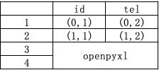

##### 通过`pandas`读取`excel`文档



准备写入`Excel`前，需要先创建`writer`对象

```python
self.writer = pandas.ExcelWriter(EXCEL_FILE)
```

如修改某行中某列的数据时，`pandas`不支持`df[i][j]赋值`赋值，需要通过`df.loc`

```python
# df不支持df[i][j]赋值，只能使用df.loc[行切片，列名]方法进行赋值，且写入的内容必须是字符串类型
self.df.loc[row:row,['case_data']] = str(case_data)
# 通过loc方法设置值后，将其在已经打开writer对象中对应工作簿中写入内容
self.df.to_excel(self.writer,case_info['sheet_name'])
# 关闭writer对象调用保存方法
self.writer.save()
# 关闭打开文件的句柄
self.writer.close()
```


创建`df`对象时，使用`index_col`参数，表示索引列

```python
# index_col表示索引列，0为第一列
self.df = pandas.read_excel(self.file_name,sheet_name,index_col=0)
```


`pandas`的`to_excel`方法在打开文件后，是根据当前传入的文件名和工作薄，去保存为`excel`文件的，在循环每一个工作薄的名称时，`df`对象内存储的总是最后一个工作薄的内容，所以还是推荐使用`openpyxl`的模块

```python
def update_tel(self,sheet_name,new_tel):
	sheet = self.wb[sheet_name]
	sheet.cell(2,2).value = new_tel+1
	self.wb.save(self.file_name)
```


查看字符串中字符的方法

```python
s = 'hello world'

# 如果没有找到目标字符串，那么就会返回-1
s.find('o')
```