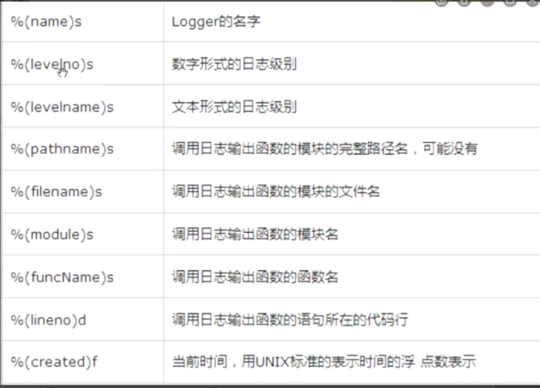

日志的级别：

从左至右级别越来越高

DEBUG、INFO、WARNING、ERROR、CRITICAL


logger 日志收集器，在源码中默认指定了收集器的名称为root，info、error、warning等

handler 日志输出渠道


```python
import logging

# logging默认输出warning级别及以上的日志
logging.info('info')
logging.warning('warning')
```


